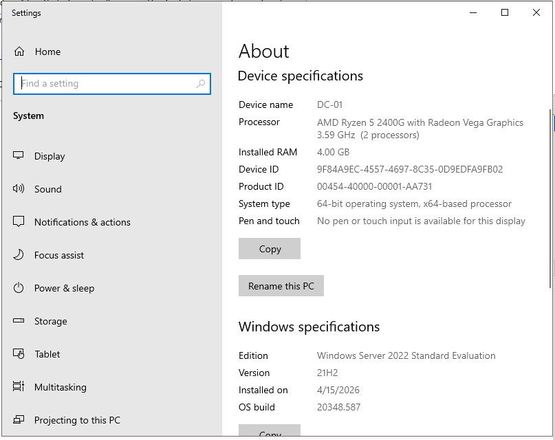
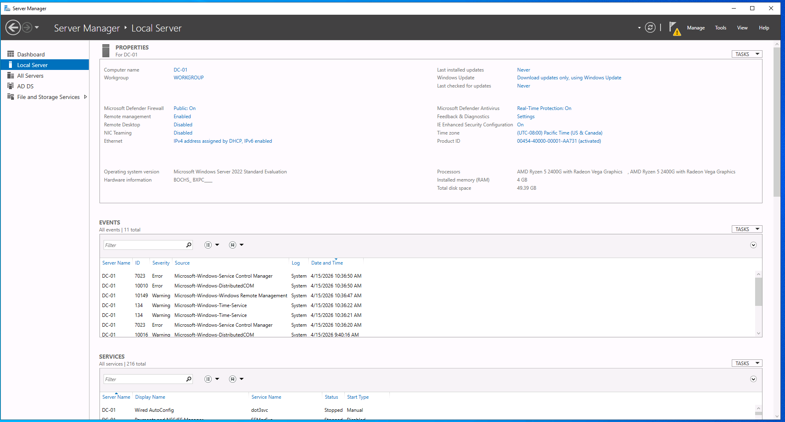
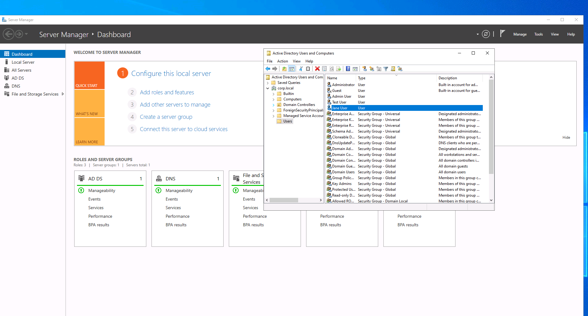
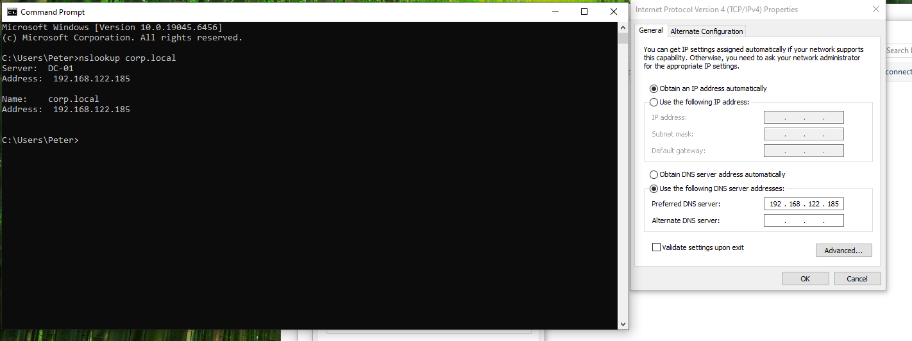
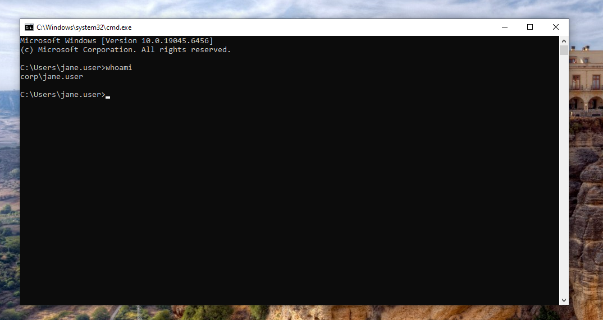
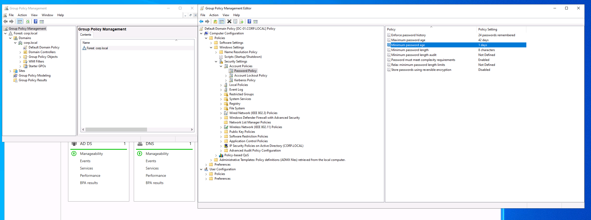
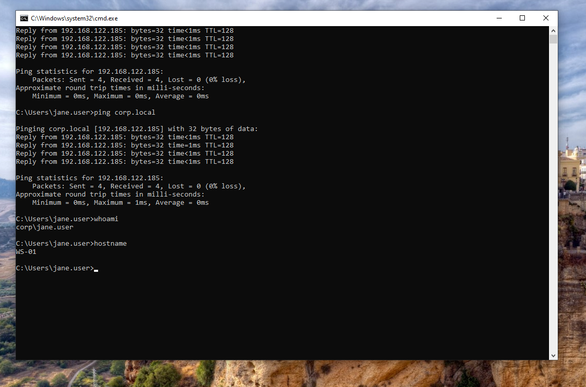

tralized security and workstation administration within a Windows domain environment. Configured password complexity requirements to enforce security standards.  

---

## Network Validation  
Validated communication between the client and the domain controller using ping and authentication checks, confirming successful DNS resolution, network connectivity, and domain-based sign-in.

---

## Key Skills Demonstrated  
- Active Directory configuration  
- Domain controller deployment  
- User and group management  
- DNS configuration  
- Domain joining  
- Group Policy management  
- Network troubleshooting  

---

## Key Takeaways  
- Active Directory environments rely heavily on proper DNS configuration  
- Domain-based administration enables centralized authentication and policy enforcement  
- Virtual lab environments can effectively simulate enterprise IT infrastructure  
- Structured documentation and validation improve troubleshooting and communication  

---

## Evidence / Screenshots

### Server System Configuration

> Windows Server 2022 installed and configured as DC-01 with 4GB RAM.

---

### Active Directory Role Installed

> Active Directory Domain Services role installed and ready for domain controller promotion.

---

### User and Group Management

> Created multiple user accounts in Active Directory Users and Computers to simulate centralized user administration within a Windows domain.

---

### Client DNS Configuration

> Configured the Windows 10 client to use the domain controller as its DNS server, enabling domain communication and authentication.

---

### Client Domain Join

> Successfully joined the Windows 10 client to the corp.local domain using domain administrator credentials.

---

### Domain User Login

> Verified successful domain authentication by logging into the client system using a centrally managed Active Directory user account.

---

### Group Policy Implementation

> Applied Group Policy settings to enforce password complexity requirements across the domain.

---

### Network Validation

> Verified connectivity and DNS resolution between the client and domain controller using network diagnostic tools.

---

## Resume Bullet Points  

- Deployed and configured a Windows Server 2022 domain controller using Active Directory Domain Services and DNS  
- Created and managed domain user accounts to simulate centralized authentication in a business environment  
- Configured a Windows 10 client to join a domain and validated domain-based login functionality  
- Implemented Group Policy settings to enforce security controls across domain systems  
- Documented environment setup, troubleshooting steps, and validation results in a structured IT lab portfolio  
