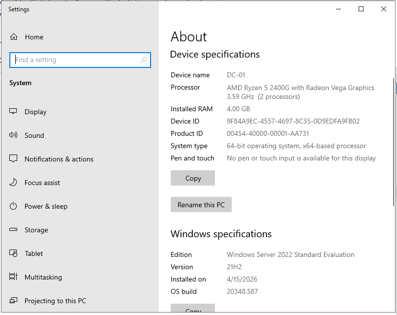
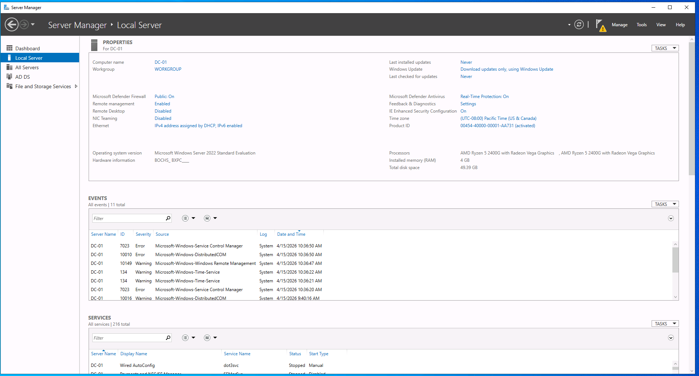
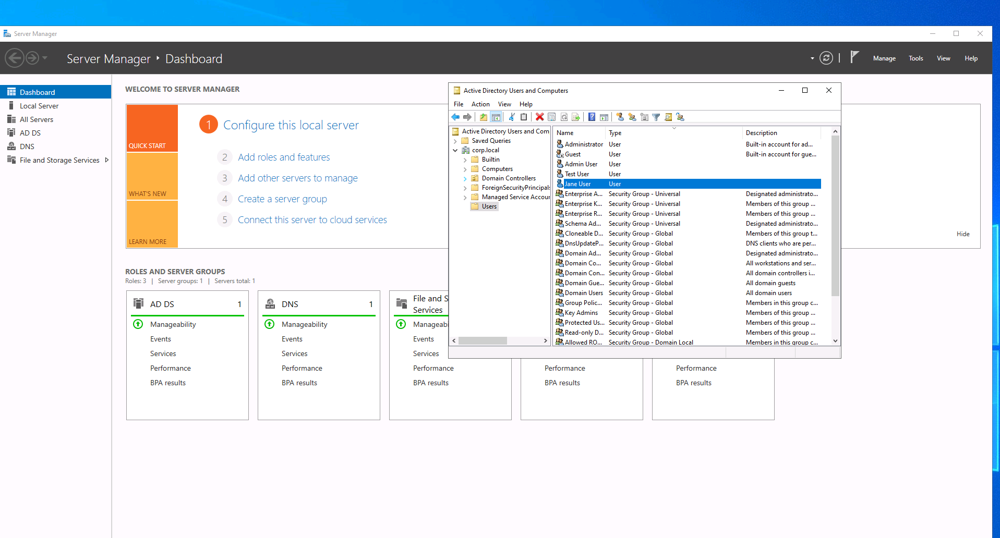
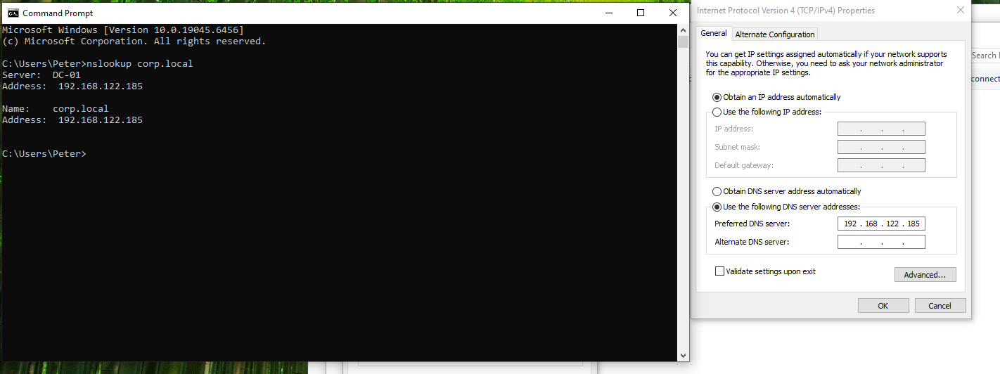
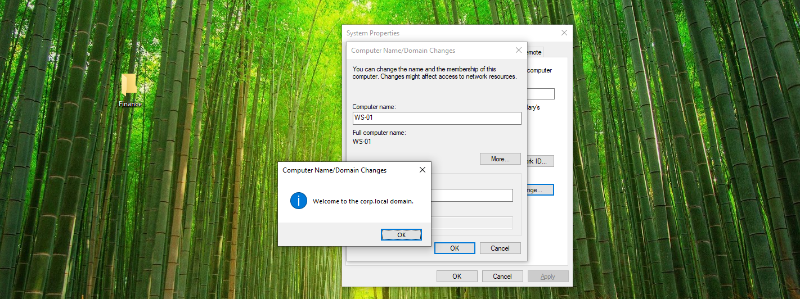
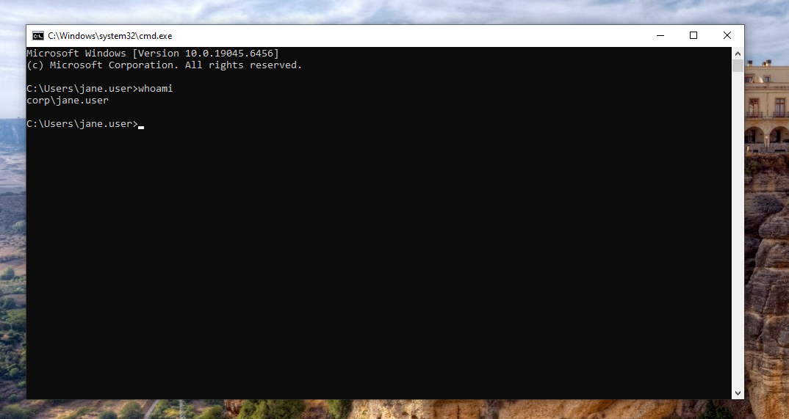
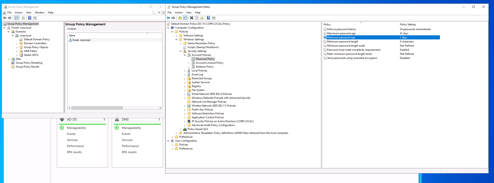
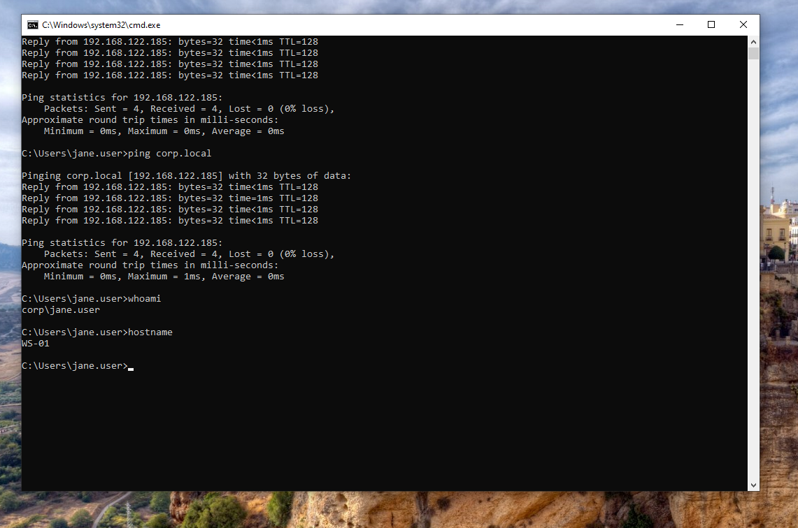

# Active Directory & Windows Support Lab

## Project Overview

Built a virtualized Windows domain environment to gain hands-on experience with Active Directory Domain Services (AD DS), DNS, domain authentication, user administration, and Group Policy.

The lab uses Windows Server 2022 as a domain controller and DNS server with a Windows 10 client joined to the domain. I used the environment to understand how Windows domain components work together and to practise configuration, validation, and troubleshooting in a controlled lab.

---

## Environment

| Component | Configuration |
| --- | --- |
| Host OS | Ubuntu Linux |
| Virtualization | QEMU/KVM with virt-manager |
| Server | Windows Server 2022 Standard (Desktop Experience) |
| Client | Windows 10 |
| VM Memory | 4 GB per VM |
| Domain | `corp.local` |
| Domain Controller | `DC-01` |
| Client Workstation | `WS-01` |
| Network | Virtual NAT network |

---

## Lab Architecture

`DC-01` provides Active Directory Domain Services and DNS for the lab environment.

`WS-01` is configured to use the domain controller for DNS and is joined to the `corp.local` domain.

```text
Ubuntu Host
│
└── QEMU/KVM Virtual Network
    │
    ├── DC-01
    │   ├── Windows Server 2022
    │   ├── Active Directory Domain Services
    │   └── DNS
    │
    └── WS-01
        ├── Windows 10
        ├── DNS → DC-01
        └── corp.local domain member
```

This setup allowed me to work with centralized authentication and administration while seeing how DNS, domain connectivity, and user authentication depend on one another.

---

# Work Completed

## 1. Windows Server and Domain Controller Setup

Installed Windows Server 2022 and added the Active Directory Domain Services role.

Promoted the server to a domain controller and created a new forest:

`corp.local`

DNS was installed alongside AD DS to provide the name resolution required by the domain environment.

### Server System Configuration



> Windows Server 2022 configured as `DC-01` with 4 GB RAM allocated to the virtual machine.

### Active Directory Role Installed



> Active Directory Domain Services installed in preparation for domain controller promotion.

---

## 2. Active Directory Users and Groups

Used Active Directory Users and Computers to create multiple domain user accounts and groups.

This provided hands-on practice with centralized identity administration rather than maintaining separate local accounts on individual workstations.

### User and Group Management



> Active Directory Users and Computers showing domain user accounts created for the lab environment.

---

## 3. Client DNS Configuration

Configured the Windows 10 client to use `DC-01` as its DNS server.

This was an important part of the lab because Active Directory depends on DNS to locate the domain controller and other domain services.

The configuration provided a practical example of why DNS should be checked when troubleshooting domain-join and authentication problems.

### Client DNS Configuration



> Windows 10 client configured to use the domain controller for DNS.

---

## 4. Windows 10 Domain Join

Configured `WS-01` for domain connectivity and successfully joined the workstation to:

`corp.local`

The domain join was completed using domain administrator credentials.

After joining the domain, I verified that the workstation could communicate with the domain controller successfully.

### Client Domain Join



> `WS-01` successfully joined to the `corp.local` domain.

---

## 5. Domain User Authentication

Tested centralized authentication by signing into the Windows 10 workstation with an Active Directory domain user account.

This verified that:

- The workstation was successfully joined to the domain
- The client could communicate with the domain controller
- DNS configuration was functioning
- The domain user could authenticate successfully

### Domain User Login



> Successful Windows 10 sign-in using a centrally managed Active Directory domain account.

---

## 6. Group Policy

Used Group Policy Management to configure password complexity requirements for the domain.

This provided hands-on experience with applying centralized configuration and security settings rather than configuring individual workstations separately.

### Group Policy Implementation



> Group Policy configured to enforce password complexity requirements within the domain.

---

## 7. Network and DNS Validation

Validated communication between the Windows 10 client and domain controller using network connectivity and authentication checks.

Testing included confirming:

- Client-to-server connectivity
- DNS resolution
- Domain membership
- Domain-user authentication

The validation process reinforced the importance of checking underlying network and DNS configuration before treating an authentication or domain problem as an Active Directory issue.

### Network Validation



> Connectivity and DNS resolution between the Windows 10 client and domain controller verified using network diagnostic tools.

---

# Support Relevance

This lab gave me practical experience with several technologies and troubleshooting concepts commonly encountered in Windows-based IT support environments:

- Active Directory user and group administration
- Windows Server and domain controller fundamentals
- Windows workstation domain membership
- Domain-based user authentication
- DNS configuration and troubleshooting
- Group Policy fundamentals
- Windows network troubleshooting
- Centralized identity and system administration
- Testing and verifying configuration changes
- Technical documentation

This is a lab environment rather than professional production experience. It provides a working environment where I can practise Windows support and administration tasks and understand how the underlying services depend on one another.

---

# What I Learned

One of the most important lessons from this lab was how closely Active Directory depends on DNS.

A workstation can have network connectivity and still fail to interact correctly with a Windows domain if its DNS configuration does not allow it to locate the domain controller and domain services.

Building the environment helped connect several concepts that are often learned separately:

**DNS → Domain Discovery → Domain Join → Authentication → Group Policy**

Working through the complete process made it easier to understand where I would begin troubleshooting if a workstation could not join the domain or a domain user could not authenticate.

I also gained experience validating each stage rather than assuming that a successful configuration change meant the entire environment was working correctly.

---

# Skills Practised

## Windows & Identity

- Windows Server 2022
- Windows 10
- Active Directory Domain Services
- Active Directory Users and Computers
- Group Policy Management
- Domain authentication

## Networking

- DNS
- Client/server connectivity
- Windows network configuration
- Network validation and troubleshooting

## Support & Administration

- User and group administration
- Workstation domain joining
- Configuration validation
- Structured troubleshooting
- Technical documentation

---

# Next Steps

This lab established my initial Windows domain environment. I plan to build on it through the newer Proxmox-based home server environment rather than presenting the current lab as more extensive than it is.

Planned work includes:

- Deploying a new Windows Server virtual machine
- Configuring Active Directory and DNS
- Adding a Windows client workstation
- Building a more structured OU, user, and group environment
- Expanding Group Policy configuration
- Adding file and shared-folder services
- Practising additional account and access support scenarios
- Creating troubleshooting scenarios involving DNS, authentication, permissions, and Group Policy
- Documenting problems encountered, diagnostic steps, resolution, and verification

The expanded environment will be documented as the work is completed.
