# Lenovo Home Server Lab

I was given an older Lenovo desktop and wanted to determine whether it could be repurposed as a home server and virtualization lab rather than leaving it unused.

The project began with troubleshooting a no-display condition and progressed through hardware inventory, memory expansion, storage health testing, virtualization configuration, bare-metal Proxmox deployment, Linux container administration, and deployment of a dedicated AdGuard Home DNS service.

The system now runs headless on my home network and is administered remotely through Proxmox. It currently hosts a general-purpose Debian LXC for Linux experimentation and a dedicated AdGuard Home LXC for local DNS resolution and filtering.

The purpose of this project is not only to deploy services, but to practice the complete process of:

- assessing existing hardware
- troubleshooting faults systematically
- planning infrastructure changes
- implementing and validating configurations
- administering Linux systems
- understanding networking and service dependencies
- documenting technical decisions
- developing repeatable troubleshooting and recovery procedures

This README documents the actual configuration, troubleshooting, decisions, commands, and validation performed as the environment develops.

---

## Current Environment

| Component | Current Configuration |
| --- | --- |
| Host | Lenovo 10A8S00200 |
| CPU | Intel Core i5-4570 |
| CPU configuration | 4 cores / 4 threads |
| Memory | 16 GB DDR3-1600 |
| Storage | 500 GB Seagate HDD |
| Hypervisor | Proxmox VE 9.2 |
| Kernel | `7.0.14-16-pve` |
| Management IP | `192.168.1.10/24` |
| Default gateway | `192.168.1.254` |
| LAN subnet | `192.168.1.0/24` |
| Virtual bridge | `vmbr0` |
| CT 100 | `debian-lab` — Debian 13 general-purpose lab |
| CT 100 networking | DHCP via `vmbr0` |
| CT 101 | `adguard` — Debian 13 / AdGuard Home |
| CT 101 address | `192.168.1.11/24` static |
| AdGuard DNS | TCP/UDP 53 |
| AdGuard administration | HTTP 80, LAN only |
| Administration | Headless via Proxmox web interface |

---

## Infrastructure Diagram

The diagram below shows the current home lab infrastructure and planned Proxmox workloads.

Solid borders represent deployed infrastructure, while dashed borders represent planned services.

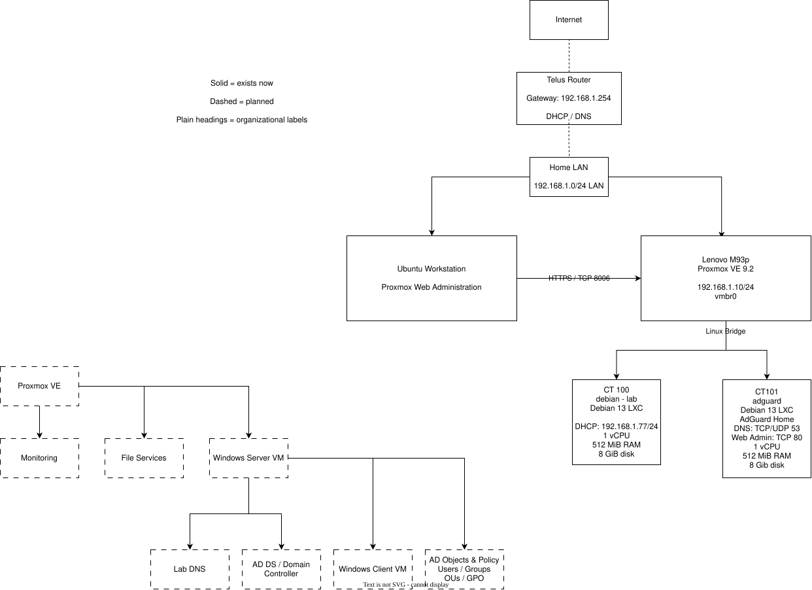

---

# 1. Initial Hardware Assessment

## Starting Hardware

| Component | Configuration |
| --- | --- |
| System | Lenovo 10A8S00200 |
| CPU | Intel Core i5-4570 @ 3.20 GHz |
| CPU configuration | 4 cores / 4 logical processors |
| Memory | 8 GB DDR3-1600 |
| Memory configuration | 2 x 4 GB Hynix |
| Storage | 500 GB Seagate HDD |
| Drive model | ST500DM002-1SB10A |
| GPU | NVIDIA T1000 |
| Firmware | UEFI |
| Original operating system | Windows 10 Pro |

---

## Initial Troubleshooting — No Display

When I first powered on the machine, the fans started, the power LED remained on, and the keyboard received power, but the monitor reported:

```text
No Signal
```

The monitor was connected by DisplayPort to the motherboard.

Since the system showed several signs that it was powering up normally, I checked the available display hardware before assuming that the RAM, motherboard, CPU, or power supply had failed.

Opening the chassis revealed an NVIDIA T1000 discrete graphics card using Mini DisplayPort outputs.

I connected the monitor directly to the T1000 using a Mini DisplayPort-to-DisplayPort cable.

Video output returned immediately and the machine booted normally.

**Cause:** The display was connected to the motherboard video output rather than the installed discrete GPU.

**Resolution:** Connected the monitor directly to the NVIDIA T1000.


This was an early example of using the available symptoms to narrow the problem before replacing hardware. The fans, power LED, and keyboard power suggested that the machine could already be completing POST, making the display path a reasonable first troubleshooting target.

---

# 2. Hardware Inventory

Once Windows was accessible, I established a hardware baseline before purchasing or replacing components.

## Windows System Information

I started with Windows System Information:

```text
msinfo32
```


This confirmed:

- Intel Core i5-4570
- 8 GB installed RAM
- UEFI firmware
- Windows 10 Pro
- Lenovo 10A8 platform

The processor reported the necessary virtualization extensions, but System Information initially showed:

```text
Virtualization Enabled in Firmware: No
```

This indicated that the CPU supported virtualization but that the feature still needed to be enabled in firmware before the system could be used as intended.

---

## Memory Investigation

I queried the installed DIMMs with PowerShell:

```powershell
Get-CimInstance Win32_PhysicalMemory |
    Select-Object DeviceLocator, Manufacturer, PartNumber, Capacity, Speed
```

The system returned two Hynix modules:

```text
Manufacturer : Hynix/Hyundai
PartNumber   : HMT451U6AFR8C-PB
Capacity     : 4294967296
Speed        : 1600
```

Each module was 4 GB, giving the system 8 GB total.


Physical inspection showed four DIMM slots with two populated.


Rather than replacing the existing memory, I decided to add another 2 x 4 GB DDR3-1600 kit.

```text
Starting memory:  8 GB
Target memory:   16 GB
```

This provided more capacity for virtual machines and containers while keeping the investment in the older platform low.

---

## Storage Investigation

Disk Management showed a single physical disk with approximately 465 GB of usable capacity.


The original Windows installation contained:

- 100 MB EFI System Partition
- approximately 465 GB NTFS Windows partition
- 548 MB Recovery partition

I queried the physical disk using PowerShell:

```powershell
Get-CimInstance Win32_DiskDrive |
    Select-Object Model, Size, Status
```

The installed drive was:

```text
Model  : ST500DM002-1SB10A
Size   : 500105249280
Status : OK
```

Because this was an older mechanical drive, I did not consider the basic Windows `OK` result sufficient evidence of its health before using it for the Proxmox installation.

---

## Physical Inspection

After shutting down and disconnecting the system, I inspected the chassis for:

- available memory slots
- storage mounting locations
- SATA connections
- PCIe expansion
- existing cabling
- general physical condition


The NVIDIA T1000 occupies the primary PCIe slot, with additional expansion available below it.

### Drive Cage

The existing Seagate HDD is mounted in Lenovo's drive assembly.


There is room to continue investigating additional storage, but I decided against purchasing an SSD immediately.

---

# 3. Upgrade Decisions and Hardware Validation

My approach was to avoid replacing hardware simply because newer hardware was available.

The initial upgrade plan became:

```text
Memory:   8 GB -> 16 GB DDR3-1600
Storage:  Retain existing 500 GB HDD
SSD:      Deferred
Backups:  Future dedicated storage
```

The existing HDD was sufficient for learning Proxmox and running lightweight services. VM and container storage performance would be lower than with an SSD, but that did not prevent the machine from fulfilling the initial objectives of the project.

---

## Memory Upgrade

I installed an additional 2 x 4 GB Gigastone DDR3-1600 kit alongside the existing Hynix memory.

```text
Existing:  2 x 4 GB Hynix DDR3-1600
Added:     2 x 4 GB Gigastone DDR3-1600
Total:     16 GB DDR3-1600
```

UEFI and Windows both detected all 16 GB operating at 1600 MHz.

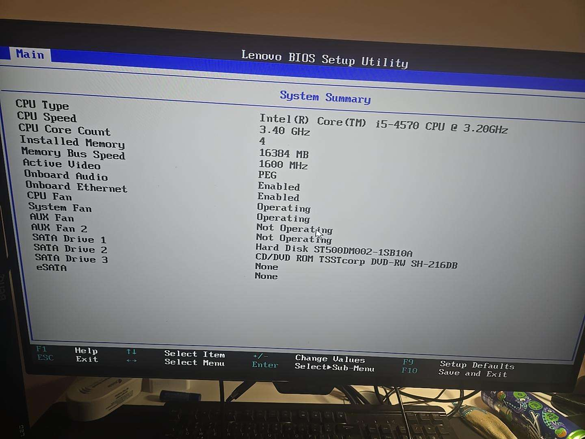

Because the final configuration uses DIMMs from two manufacturers, detection alone was not enough to consider the upgrade validated.

---

## Memory Testing

I ran Windows Memory Diagnostic using two passes.

After the test completed, I checked Event Viewer.

Event ID 1201 reported:

```text
The Windows Memory Diagnostic tested the computer's memory and detected no errors.
```

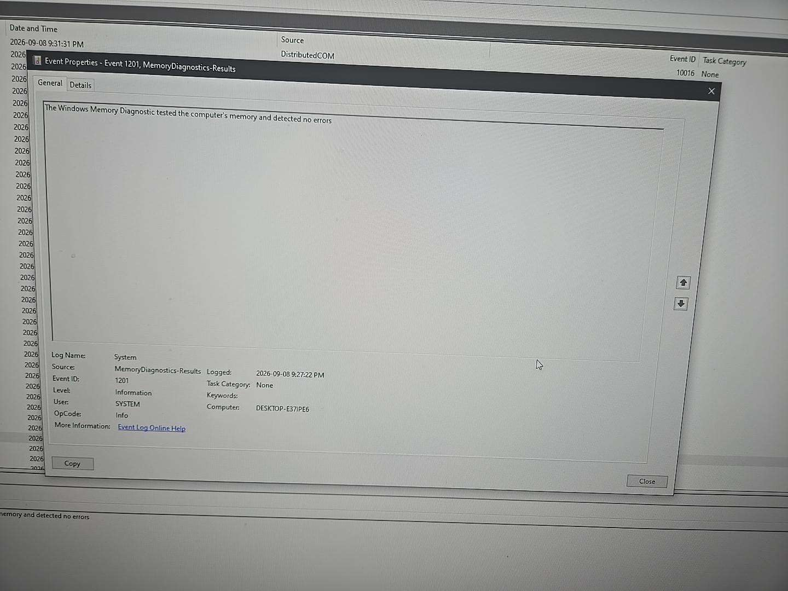

With all 16 GB detected and the diagnostic completing without errors, I retained the mixed Hynix and Gigastone configuration.

---

## Virtualization Readiness

I entered UEFI and enabled:

- Intel Virtualization Technology (VT-x)
- Intel VT-d

After returning to Windows, System Information reported:

```text
Hyper-V - VM Monitor Mode Extensions: Yes
Hyper-V - Second Level Address Translation Extensions: Yes
Hyper-V - Virtualization Enabled in Firmware: Yes
Hyper-V - Data Execution Prevention: Yes
```

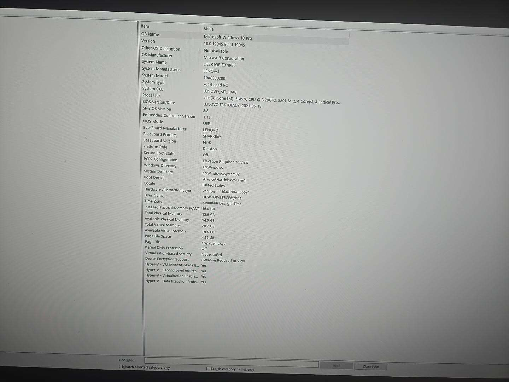

This confirmed that the machine was ready for use as a virtualization host.

---

## HDD Health Validation

Because I planned to retain the existing HDD, I used `smartmontools` to inspect its SMART data.

Important attributes included:

```text
Reallocated sectors:       0
Reported uncorrectable:    0
Current pending sectors:   0
Offline uncorrectable:     0
UDMA CRC errors:           0
Power-on hours:            ~10,272
Temperature:               34 C
```

The SMART error log contained no recorded disk errors.

I then ran an extended SMART self-test.

The completed test reported:

```text
Completed without error
```

No first-error LBA was reported.

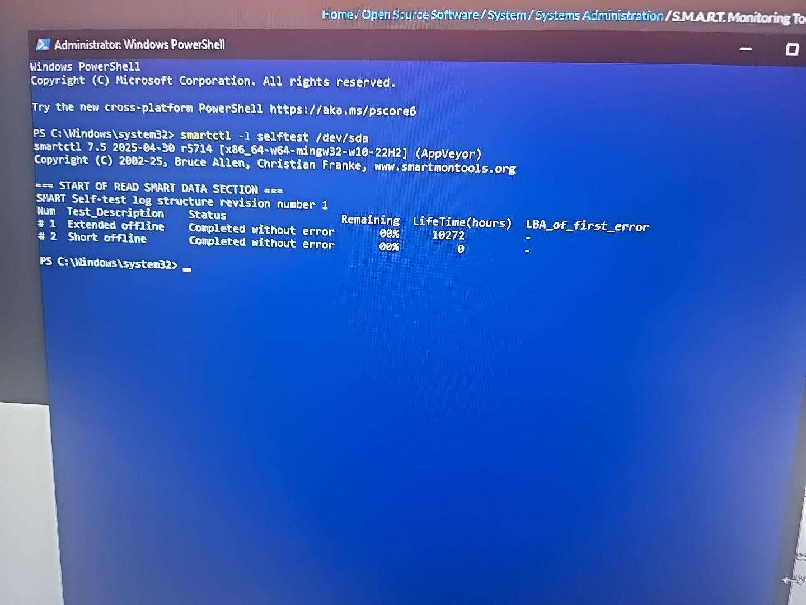

These results were sufficient for the initial lab deployment.

The HDD remains older mechanical storage, so it will not be treated as the only copy of important data. Backup storage and a future SSD upgrade remain planned improvements.

---

# 4. Proxmox VE Deployment

With the memory, virtualization support, and storage validated, I replaced Windows with Proxmox VE.

Proxmox was installed directly on the Lenovo as a bare-metal hypervisor.

The initial management configuration was:

```text
Hostname:         pve
Management IP:    192.168.1.10/24
Default gateway:  192.168.1.254
Web interface:    https://192.168.1.10:8006
```

The management address is static so access to the hypervisor does not depend on a changing DHCP lease.

The Proxmox web interface currently uses its default self-signed certificate, so browsers display a certificate warning when accessing it over the LAN.

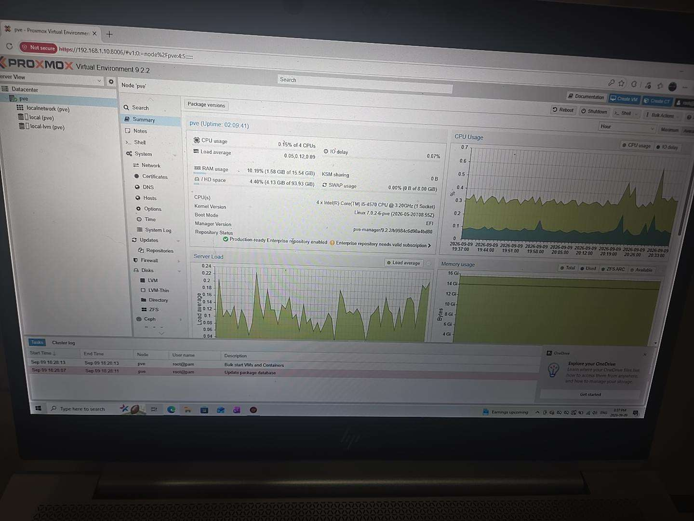

---

# 5. Repository Troubleshooting and Host Updates

After installation, I attempted to update the Proxmox host.

The update returned:

```text
401 Unauthorized
```

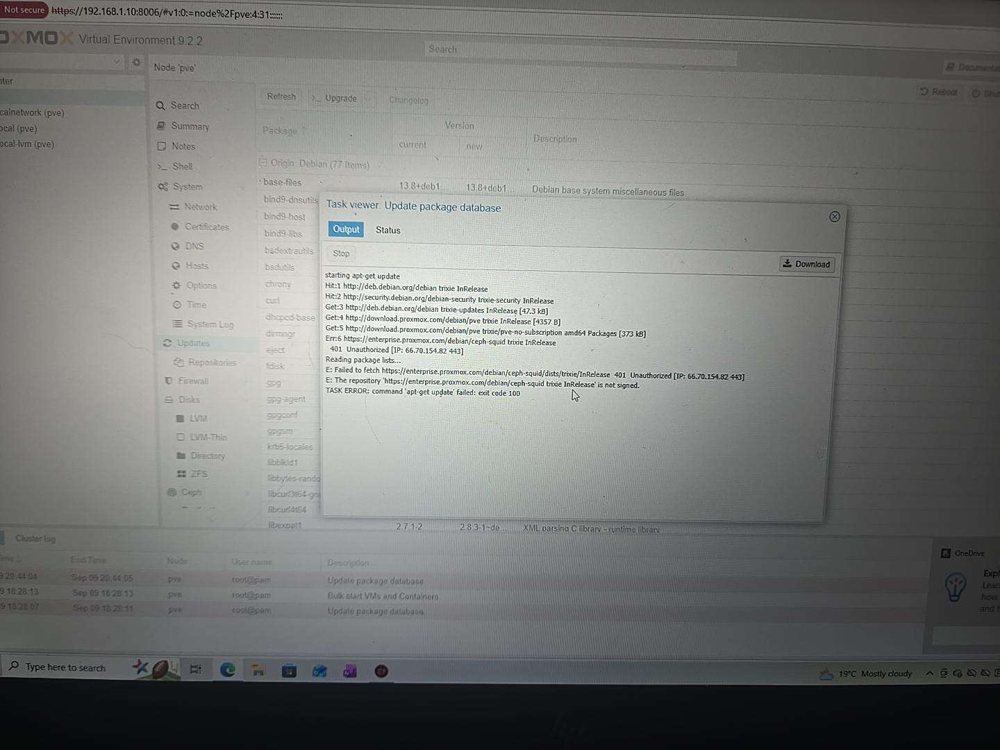

Rather than treating this as a general connectivity failure, I examined which repository was returning the error.

The failing source was the Proxmox enterprise repository.

The enterprise repository requires a paid subscription, which this lab does not use.

I enabled:

```text
pve-no-subscription
```

A subsequent update still produced an authorization error because the enterprise Ceph repository remained enabled.

I disabled the enterprise Ceph repository and ran the update again.

The host then successfully retrieved updates from:

- Debian repositories
- Debian security repositories
- Proxmox no-subscription repository

The update completed with:

```text
TASK OK
```

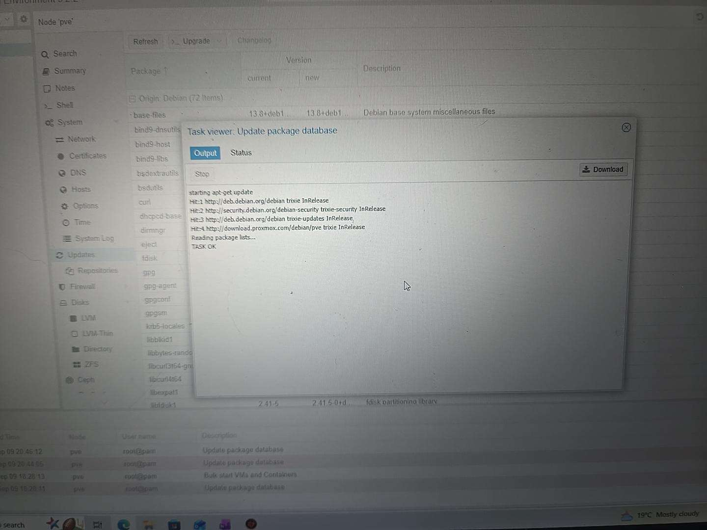

### Troubleshooting Summary

```text
Symptom
   |
   v
apt update returns 401 Unauthorized
   |
   v
Identify failing repository
   |
   v
Enterprise repository requires subscription
   |
   v
Enable pve-no-subscription
   |
   v
401 remains
   |
   v
Identify enterprise Ceph repository
   |
   v
Disable enterprise Ceph repository
   |
   v
Retest
   |
   v
TASK OK
```

This demonstrated the importance of reading the specific error source rather than assuming that all package update failures indicate broken networking.

---

## Kernel Update Verification

After the updates, Proxmox reported that a new kernel had been installed.

I rebooted the host and checked:

```bash
uname -r
```

The system returned:

```text
7.0.14-16-pve
```

This confirmed that the host had successfully booted using the updated kernel.

---

# 6. Proxmox Networking

I inspected the host networking with:

```bash
ip addr
ip route
```

The relevant configuration was:

```text
Management bridge:  vmbr0
Host address:       192.168.1.10/24
Default gateway:    192.168.1.254
LAN subnet:         192.168.1.0/24
```

The physical Ethernet interface is attached to the Linux bridge `vmbr0`.

The routing table showed:

```text
default via 192.168.1.254 dev vmbr0
192.168.1.0/24 dev vmbr0 proto kernel scope link src 192.168.1.10
```

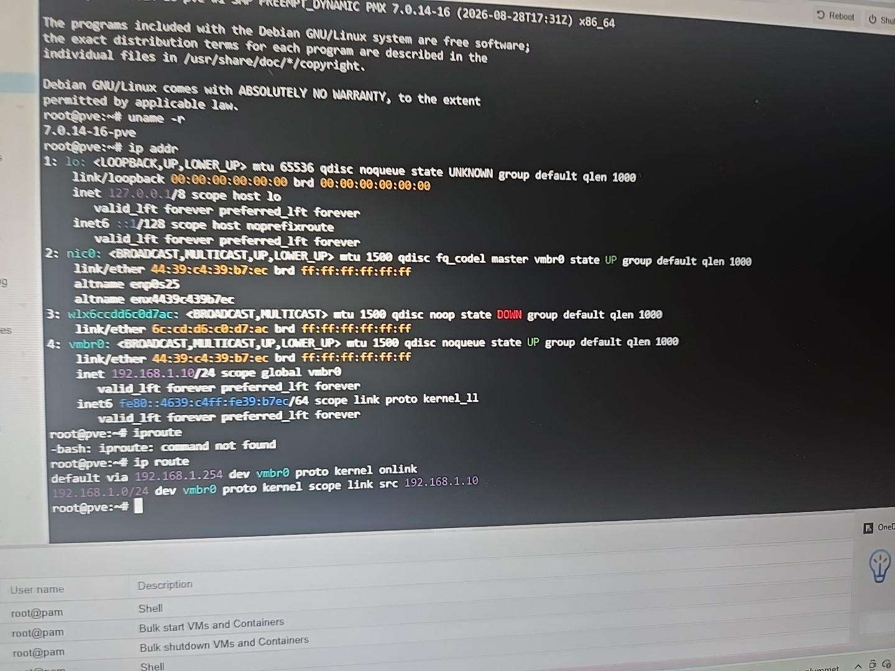

`vmbr0` allows virtual machines and containers to communicate through the physical network interface while appearing as individual systems on the LAN.

This provided practical experience with the distinction between a physical network interface and the Linux bridge used by the hypervisor.

---

# 7. Proxmox Storage Layout

After installation, I initially noticed that:

```bash
df -h
```

showed approximately 94 GB for the root filesystem even though the machine contains a 500 GB disk.

Rather than assuming the remaining capacity was missing, I inspected the block-device layout:

```bash
lsblk
```

The Proxmox installer had created approximately:

```text
500 GB Seagate HDD
|
+-- EFI partition
|
+-- pve-swap       8 GB
|
+-- pve-root      96 GB
|
+-- pve-data     ~337 GB LVM-thin pool
```

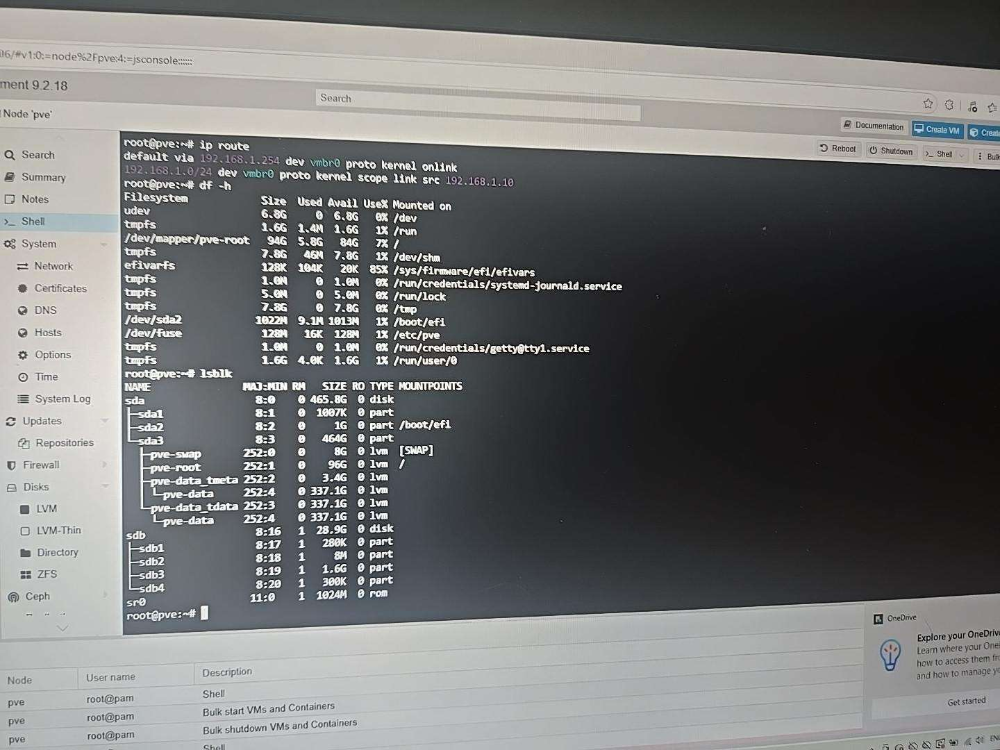

The capacity was therefore accounted for.

`df -h` reports mounted filesystems, while the `pve-data` LVM-thin pool provides storage for VM and LXC disks and does not appear as a conventional mounted filesystem.

Within Proxmox, the storage is presented primarily as:

- `local` — directory-based storage for templates and backups
- `local-lvm` — LVM-thin storage for VM and LXC virtual disks

This was another useful troubleshooting example where the first command did not provide the complete picture.

---

# 8. First LXC Container

I created a general-purpose Debian environment before deploying any household service.

This gives me a lightweight container that can be modified, broken, troubleshot, and rebuilt without affecting other systems.

I downloaded:

```text
debian-13-standard_13.6-1_amd64.tar.zst
```

and created:

| Setting | Configuration |
| --- | --- |
| CT ID | 100 |
| Hostname | `debian-lab` |
| Operating system | Debian 13 |
| Container type | Unprivileged LXC |
| CPU | 1 core |
| Memory | 512 MiB |
| Swap | 512 MiB |
| Root disk | 8 GiB |
| Storage | `local-lvm` |
| Network bridge | `vmbr0` |
| IPv4 | DHCP |

The resource allocation was intentionally small because the container is intended as a basic Linux lab rather than a resource-intensive workload.

---

## Layered Network Validation

After starting the container, I inspected:

```bash
ip addr
ip route
```

The container received:

```text
192.168.1.77/24
```

Its routing table included:

```text
default via 192.168.1.254 dev eth0
192.168.1.0/24 dev eth0 proto kernel scope link src 192.168.1.77
```

Rather than treating a single successful ping as proof that networking was working, I tested connectivity in layers.

### Local Gateway

```bash
ping -c 4 192.168.1.254
```

A successful response confirmed connectivity between the container and the router.

### Internet Routing

```bash
ping -c 4 1.1.1.1
```

This tested external connectivity without requiring DNS.

### DNS Resolution

```bash
ping -c 4 google.com
```

This tested hostname resolution.

The sequence can be represented as:

```text
Container
    |
    v
Local network
    |
    v
Default gateway
    |
    v
Internet routing
    |
    v
DNS resolution
```

If the gateway and `1.1.1.1` had responded while `google.com` failed, DNS would have become the primary troubleshooting target.

This layered approach is now part of the troubleshooting process I use when diagnosing basic network connectivity.

---

## Container Updates and Resource Usage

Once networking was validated:

```bash
apt update
apt upgrade
```

I then checked resource usage:

```bash
free -h
df -h
```

At idle, the container was using approximately:

```text
Memory:  34 MiB / 512 MiB
Disk:    713 MiB / 8 GiB
```

This demonstrated the low resource overhead of LXC for lightweight Linux workloads.

---

# 9. AdGuard Home DNS Deployment

After validating the general-purpose Debian container, I deployed the first dedicated network service on the Proxmox host.

I chose AdGuard Home to gain practical experience with:

- DNS
- static addressing
- Linux services
- TCP/UDP ports
- client/server communication
- DNS filtering
- service validation
- troubleshooting network dependencies

Rather than installing AdGuard Home inside `debian-lab`, I created a dedicated container so the experimental Linux environment could remain disposable.

The basic DNS path is:

```text
Ubuntu workstation
        |
        | DNS query
        v
AdGuard Home LXC
192.168.1.11
        |
        | upstream DNS
        v
Internet resolver
```

---

## AdGuard Container Configuration

I created a second unprivileged Debian 13 LXC:

| Setting | Configuration |
| --- | --- |
| CT ID | 101 |
| Hostname | `adguard` |
| Operating system | Debian 13 |
| Container type | Unprivileged LXC |
| CPU | 1 core |
| Memory | 512 MiB |
| Swap | 512 MiB |
| Root disk | 8 GiB |
| Storage | `local-lvm` |
| Network bridge | `vmbr0` |
| IPv4 | `192.168.1.11/24` |
| Default gateway | `192.168.1.254` |

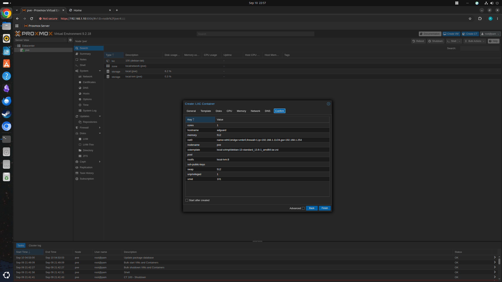
Unlike `debian-lab`, the AdGuard container was assigned a static IPv4 address.

A DNS server requires a predictable address because clients need to know where to send DNS queries.

The resulting configuration was:

```text
AdGuard Home:     192.168.1.11/24
Default gateway:  192.168.1.254
Bridge:           vmbr0
```

---

# 10. AdGuard Pre-Installation Validation

Before installing the application, I established a known-good network baseline.

I checked:

```bash
ip addr
ip route
```

The relevant routing configuration was:

```text
default via 192.168.1.254 dev eth0
192.168.1.0/24 dev eth0 proto kernel scope link src 192.168.1.11
```

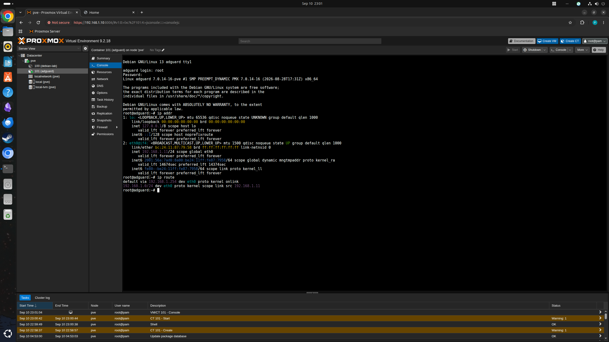

I then tested connectivity in stages:

```bash
ping -c 4 192.168.1.254
ping -c 4 1.1.1.1
ping -c 4 google.com
```

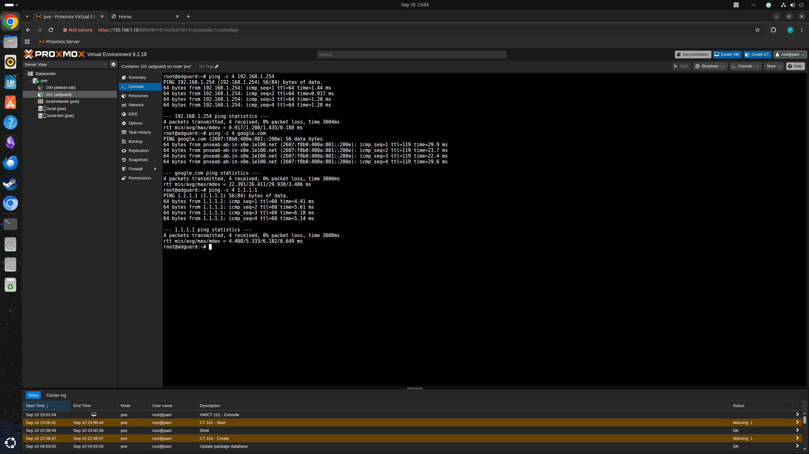

These tests established that:

```text
Static addressing       PASS
Local gateway           PASS
Internet routing        PASS
DNS resolution          PASS
```

Establishing this baseline before installing AdGuard meant that a later failure could be separated from an existing network configuration problem.

---

## Pre-Installation Port Check

I inspected existing listening sockets:

```bash
ss -tulpn
```

This allowed me to confirm that another DNS service was not already occupying port 53 before installing AdGuard Home.

I also updated the Debian container:

```bash
apt update
apt upgrade
```

and confirmed that it was running Debian 13.

---

# 11. AdGuard Installation and Service Validation

AdGuard Home was installed under:

```text
/opt/AdGuardHome
```

The installed version was:

```text
AdGuard Home v0.107.79
```

After installation, I checked the service:

```bash
/opt/AdGuardHome/AdGuardHome -s status
```

The application reported:

```text
service: running
```

I then checked listening sockets again:

```bash
ss -tulpn
```

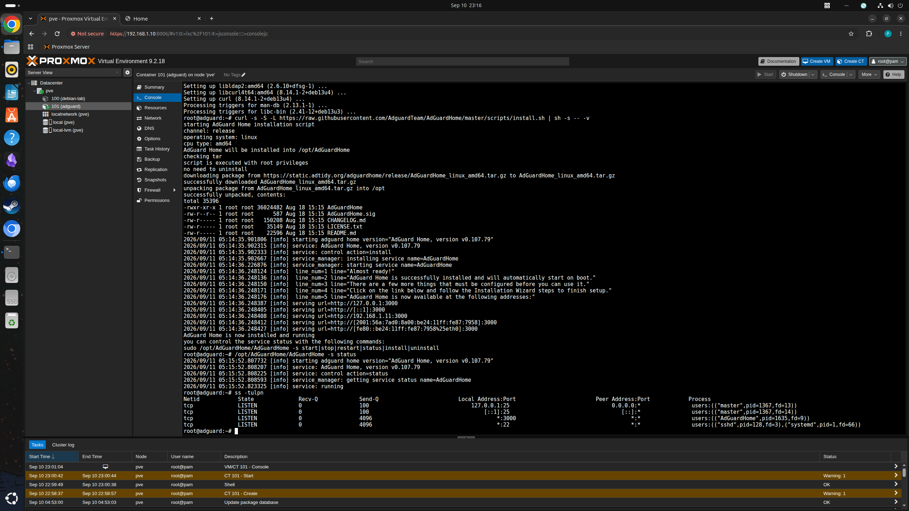

This provided two separate forms of validation:

```text
Application service status     PASS
Expected network listeners     PASS
```

I did not rely solely on the web interface loading as proof that the complete service was functioning.

---

# 12. DNS and Administrative Interface Configuration

During initial setup, I configured AdGuard Home to use the container's static interface.

The primary services became:

```text
Web administration:  192.168.1.11:80
DNS service:         192.168.1.11:53
```

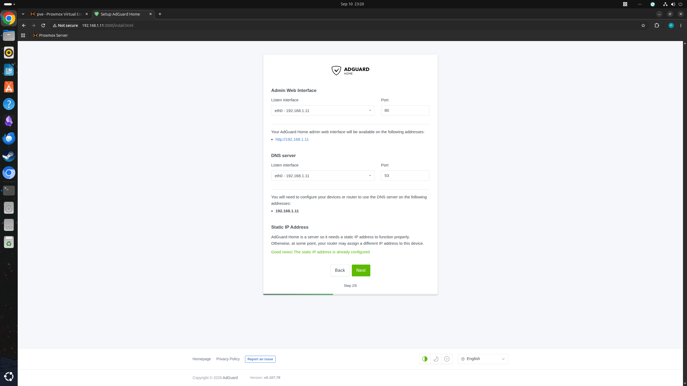

Port 53 provides DNS service to clients.

Port 80 provides the administrative interface on the local network.

The administrative interface has not been exposed directly to the Internet.

---

# 13. Client-Side DNS Validation

Rather than immediately changing DNS for the entire household, I first tested the service directly from my Ubuntu workstation.

This limited the impact of a configuration error while still allowing the complete DNS path to be validated.

From the workstation:

```bash
dig @192.168.1.11 google.com
```

The query completed successfully.

The response identified:

```text
SERVER: 192.168.1.11#53(192.168.1.11) (UDP)
```

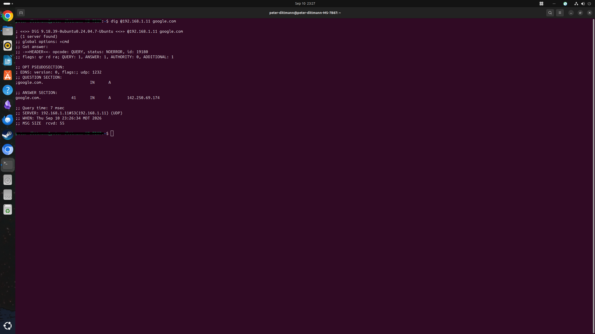

I then checked the AdGuard Home query log.

The corresponding `google.com` request appeared with my Ubuntu workstation at `192.168.1.86` identified as the client.

This provided validation from both ends:

```text
CLIENT
Ubuntu workstation
        |
        | query
        v
SERVER
AdGuard Home
        |
        | upstream lookup
        v
External resolver
        |
        | response
        v
Ubuntu workstation
```

The workstation demonstrated that the query succeeded.

The server log demonstrated that AdGuard actually received and processed it.

---

# 14. DNS Filtering Validation

Successful resolution demonstrated that AdGuard could operate as a DNS server, but it did not prove that filtering worked.

I created a temporary custom filtering rule for:

```text
adguard-lab-test.invalid
```

From the Ubuntu workstation:

```bash
dig @192.168.1.11 adguard-lab-test.invalid
```

AdGuard returned:

```text
0.0.0.0
```

while identifying the DNS server as:

```text
SERVER: 192.168.1.11#53(192.168.1.11) (UDP)
```

I then checked the AdGuard Home query log.

The request appeared as:

```text
adguard-lab-test.invalid
Blocked
Custom filtering rules
Client: 192.168.1.86
```

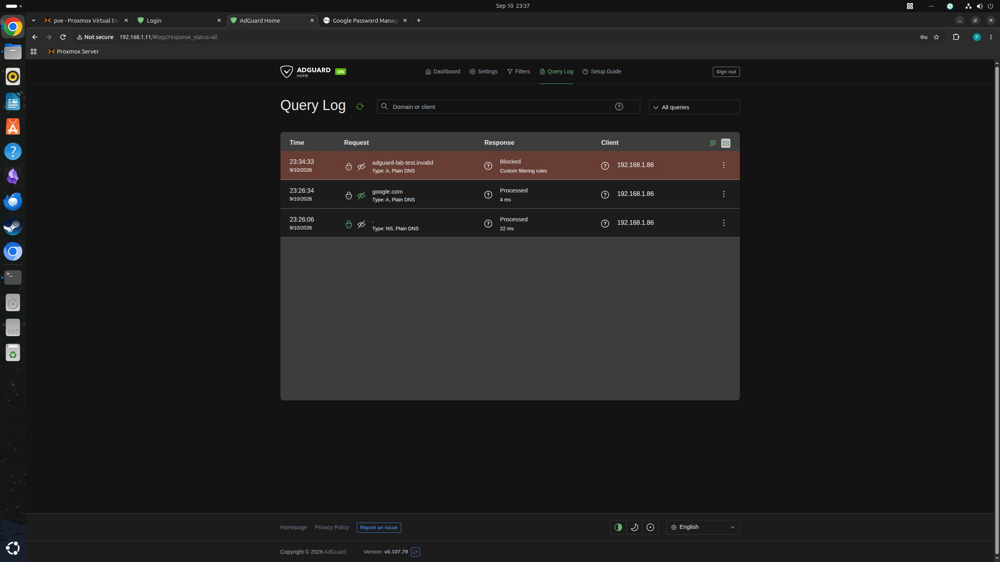

The complete test path was therefore:

```text
Client generates DNS query
        |
        v
AdGuard receives query
        |
        v
Filtering rules evaluated
        |
        v
Custom rule matched
        |
        v
Request blocked
        |
        v
Blocked response returned
        |
        v
Event recorded in query log
```

Using a controlled test hostname provided a repeatable test instead of depending on whether a real advertising or tracking domain happened to be blocked.

---

# 15. AdGuard Deployment Validation

At the end of the deployment I had independently validated:

- static IP configuration
- correct default route
- local gateway connectivity
- external IP connectivity
- DNS resolution before application installation
- availability of port 53 before installation
- successful AdGuard Home installation
- running application service
- expected DNS listener
- local administrative interface
- successful DNS resolution from another machine
- corresponding server-side query logging
- custom DNS filtering
- corresponding blocked-query logging

The deployment was therefore validated beyond simply confirming that the AdGuard dashboard loaded.

I verified the underlying network, application state, network listener, client/server communication, normal DNS resolution, and filtering behavior separately.

---

# 16. Headless Deployment and Remote Administration

After validating the Proxmox host, I moved the machine to its intended location near the home network equipment.

The Lenovo runs without a dedicated monitor, keyboard, or mouse and connects to the LAN through wired Ethernet.

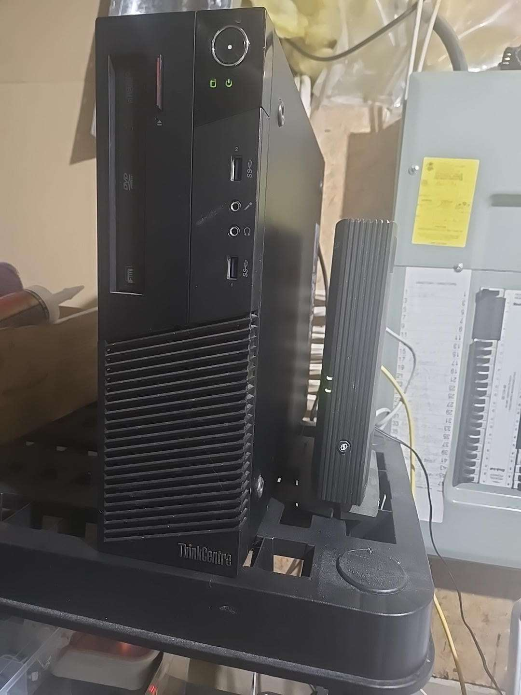

Administration is performed from another workstation using:

```text
https://192.168.1.10:8006
```

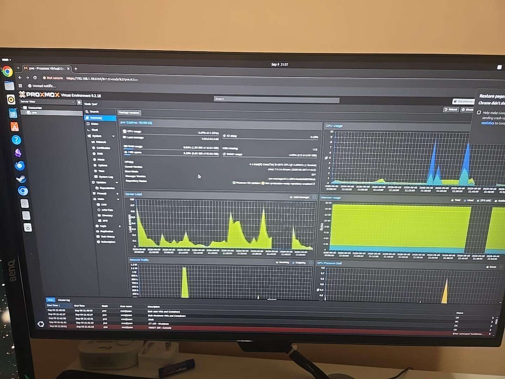

The management path is:

```text
Administration workstation
        |
        | LAN
        v
Home router
        |
        | Ethernet
        v
Lenovo Proxmox host
        |
        +---- vmbr0
                 |
                 +---- CT 100: debian-lab
                 |
                 +---- CT 101: adguard
```

This completed the original objective of converting the unused desktop into a remotely administered virtualization host.

---

# 17. Troubleshooting Method

As the lab has developed, I have started using a repeatable troubleshooting process rather than immediately changing configurations when something fails.

My general process is:

```text
Identify the symptom
        |
        v
Determine scope and impact
        |
        v
Gather configuration and error information
        |
        v
Establish what is already working
        |
        v
Isolate the failing layer/component
        |
        v
Make one controlled change
        |
        v
Retest
        |
        v
Verify normal operation
        |
        v
Document the cause and resolution
```

Examples from this project include:

### No Display

```text
Power present
-> system appeared to POST
-> inspect display path
-> identify discrete GPU
-> move display connection
-> video restored
```

### Proxmox Update Failure

```text
401 Unauthorized
-> identify failing repository
-> determine subscription requirement
-> correct repository configuration
-> identify remaining Ceph enterprise source
-> disable it
-> rerun update
-> TASK OK
```

### Container Networking

```text
Check IP configuration
-> check route
-> test gateway
-> test external IP
-> test hostname
-> isolate DNS only after lower layers work
```

### AdGuard DNS

```text
Validate network first
-> check port availability
-> install service
-> verify service state
-> verify listening port
-> query from separate client
-> verify server-side log
-> test filtering
-> verify blocked request
```

This process is intentionally being developed alongside the technical environment so that the lab improves both my administration skills and my troubleshooting habits.

---

# 18. Process Documentation

As services become more important, I am separating high-level project documentation from repeatable operational procedures.

The README explains:

- what I built
- why I made particular decisions
- what problems occurred
- how the environment was validated

Separate process documentation will be used for procedures that should be repeatable without reconstructing the original project.

Planned documentation includes:

```text
docs/
|
+-- adguard-deployment.md
|
+-- adguard-recovery.md
|
+-- proxmox-backup-restore.md
|
+-- troubleshooting/
    |
    +-- proxmox-repository-401.md
    |
    +-- dns-resolution-failure.md
```

A process document will generally use the following structure:

```text
Purpose
Prerequisites
Expected configuration
Procedure
Validation
Common failures
Rollback / recovery
```

Troubleshooting incident documentation will instead focus on:

```text
Symptom
Impact
Initial observations
Diagnostic process
Root cause
Resolution
Validation
Lessons learned
```

This allows the repository to function as both a project portfolio and a growing technical knowledge base.

---

# 19. Intended Use

The Proxmox host currently serves two purposes:

1. a home infrastructure platform
2. an IT administration and troubleshooting lab

The first dedicated network service is AdGuard Home at `192.168.1.11`.

The original `debian-lab` container remains a general-purpose environment that can be modified or rebuilt without affecting the DNS service.

Future workloads will continue to be separated according to their purpose and potential impact.

Planned additions include:

- additional Linux containers and VMs
- Windows Server
- Active Directory Domain Services
- isolated Windows Server DNS
- Windows client testing
- SMB file sharing
- backups
- host and service monitoring

Experimental Active Directory and Windows DNS services will remain separate from AdGuard Home so that domain experiments can be broken, rebuilt, and reconfigured without affecting normal household DNS.

The environment will continue to evolve incrementally, with each service tested and documented before additional dependencies are introduced.

---

# 20. Next Steps

The next stages of the project are:

- create a basic Proxmox backup strategy
- back up an LXC container
- perform and document an LXC restore
- create an AdGuard service recovery procedure
- intentionally simulate a DNS service failure and diagnose it
- determine whether AdGuard should eventually be distributed to additional clients through DHCP
- create a Windows Server VM
- build an isolated Active Directory environment
- create a Windows client VM
- add monitoring for the host and important services
- investigate SMB file sharing
- evaluate a future SATA SSD upgrade
- continue creating troubleshooting scenarios using `debian-lab`

The next priority is not simply adding more services. I want to practice operating, breaking, troubleshooting, recovering, and documenting the services that already exist before significantly expanding the environment.

---

## Skills Practiced

This project currently provides hands-on practice with:

- PC hardware troubleshooting
- hardware inventory and validation
- memory installation and testing
- SMART disk diagnostics
- UEFI configuration
- Intel VT-x and VT-d
- Proxmox VE
- bare-metal virtualization
- Linux administration
- Debian
- LXC containers
- Linux bridges
- static IPv4 addressing
- DHCP
- routing
- DNS
- TCP/UDP ports
- AdGuard Home
- Linux service validation
- `ip addr`
- `ip route`
- `ping`
- `dig`
- `ss`
- `lsblk`
- `df`
- `free`
- package management
- layered troubleshooting
- client/server validation
- technical documentation
- change validation
- infrastructure planning

---

This project is a work in progress. The repository will continue to be updated with actual configurations, troubleshooting cases, process documentation, recovery procedures, and additional services as the lab develops.
