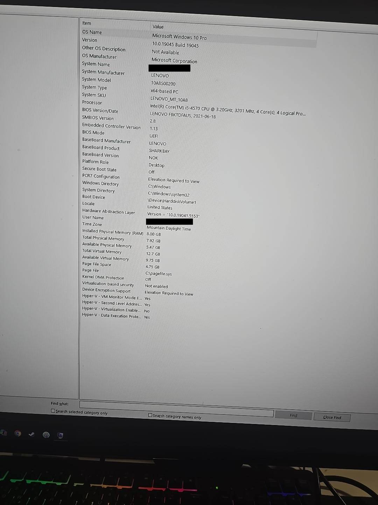
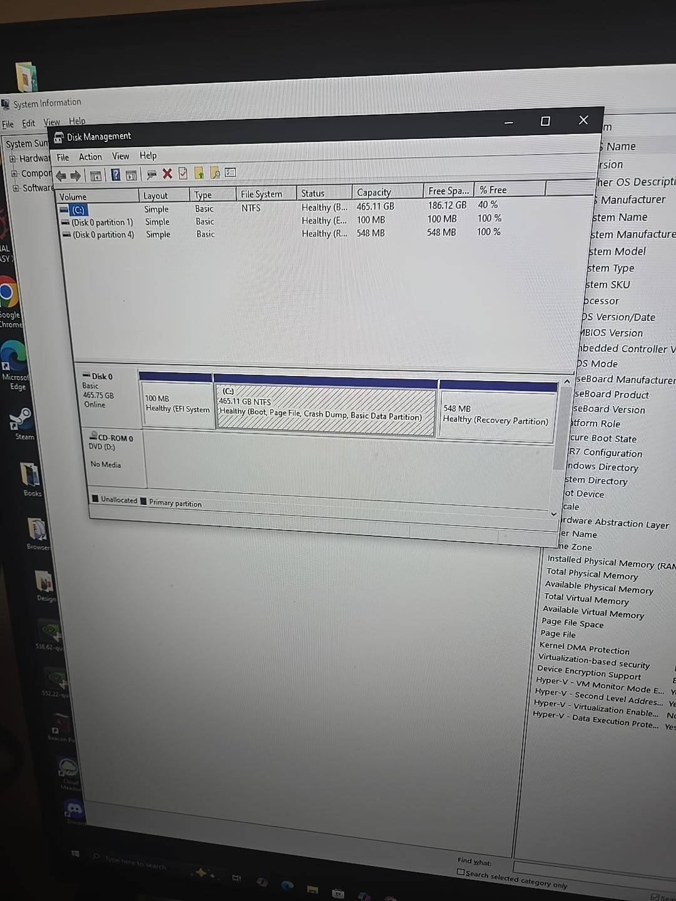
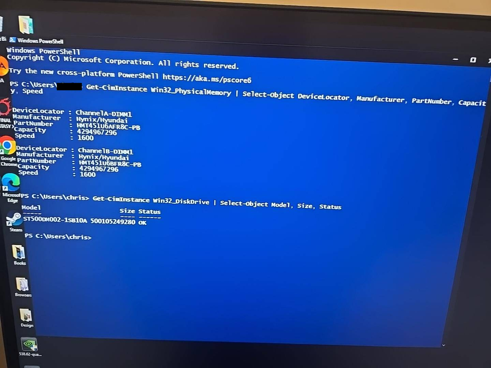
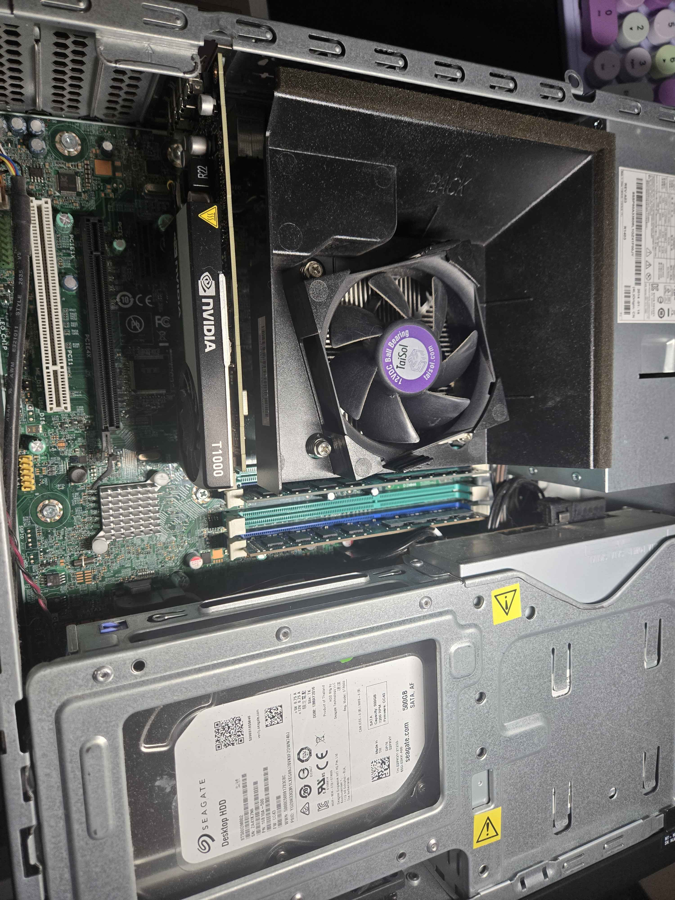
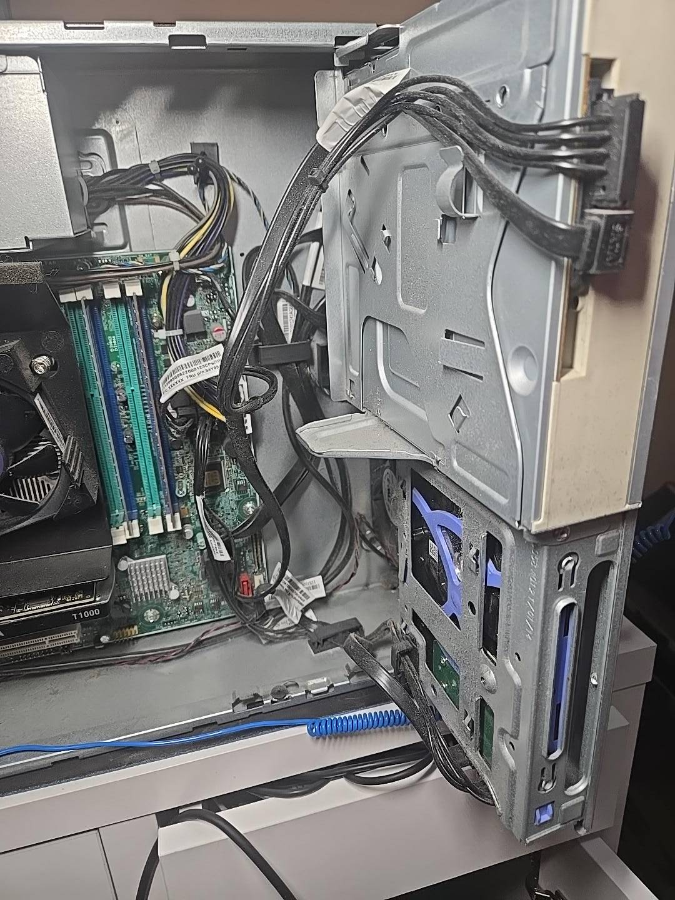
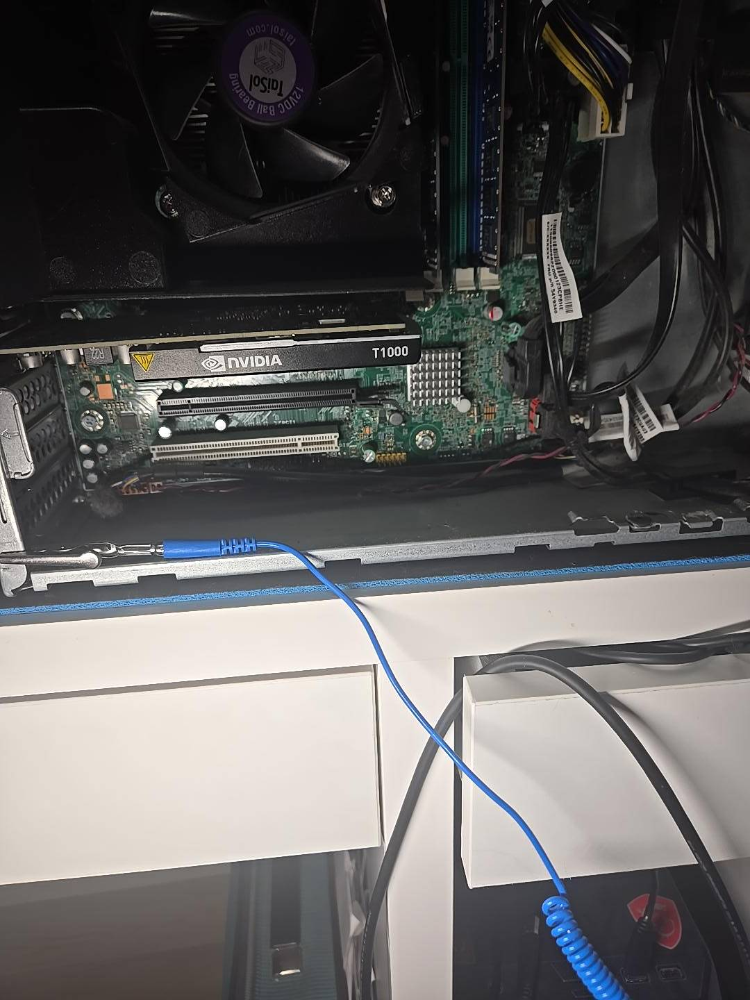

# Home Server & Virtualization Lab

> Repurposing an older Lenovo business desktop into a home infrastructure server and virtualization lab through hardware troubleshooting, system assessment, upgrades, and eventually Proxmox VE.


---

## Project Overview

This project began with an older Lenovo business desktop that powered on but produced no display output.

Rather than replacing or discarding the system, I diagnosed the initial fault, restored video output, inventoried the hardware using Windows administration tools and PowerShell, physically inspected the system, and evaluated its suitability for reuse.

The long-term objective is to convert the computer into a **Proxmox-based home server and virtualization lab** capable of supporting both household infrastructure and isolated IT lab environments.

Planned services include:

- Network-wide DNS filtering
- Centralized file storage
- Automated backups
- Linux servers and containers
- Windows Server lab environments
- Monitoring
- Virtual networking
- Future media services

This README documents the project from the original troubleshooting incident through deployment.

---

## Objectives

- Diagnose and resolve the initial no-display condition
- Establish an accurate hardware inventory
- Assess the condition and expandability of the system
- Determine whether upgrading the hardware is economically worthwhile
- Increase memory for virtualization workloads
- Enable hardware virtualization
- Deploy Proxmox VE
- Build isolated Linux and Windows environments
- Implement useful household network services
- Configure centralized storage and backups
- Document configuration, troubleshooting, testing, and recovery

---

## Project Status

| Phase | Description | Status |
|---|---|:---:|
| 1 | Initial troubleshooting | ✅ Complete |
| 2 | Hardware inventory | ✅ Complete |
| 3 | Physical inspection | ✅ Complete |
| 4 | Upgrade assessment | ✅ Complete |
| 5 | RAM upgrade and validation | 🟡 Planned |
| 6 | Virtualization configuration | 🟡 Planned |
| 7 | Proxmox VE deployment | ⚪ Planned |
| 8 | DNS filtering | ⚪ Planned |
| 9 | File storage / NAS services | ⚪ Planned |
| 10 | Automated backups | ⚪ Planned |
| 11 | Windows/Linux virtual lab | ⚪ Planned |
| 12 | Monitoring and documentation | ⚪ Planned |

---

# Phase 1 — Initial Troubleshooting

## Initial Problem

The system powered on but displayed **No Signal** on the connected monitor.

Observed symptoms included:

- Power LED remained illuminated
- System fans were operating
- USB keyboard received power
- No display output
- No obvious POST beep codes
- Monitor reported `No Signal`

The monitor was initially connected to a DisplayPort output on the motherboard.

### Troubleshooting Approach

Rather than immediately assuming a failed motherboard, RAM, CPU, or power supply, I inspected the system for additional display hardware.

Physical inspection revealed an installed discrete NVIDIA graphics adapter with Mini DisplayPort outputs.

I connected the monitor directly to the discrete graphics adapter using a Mini DisplayPort-to-DisplayPort connection.

### Result

**Video output was immediately restored and the system successfully booted into Windows.**

### Root Cause

The computer was operational and successfully POSTing.

The display was connected to a motherboard video output that was not providing the system's active display signal while the discrete graphics adapter was installed.

### Resolution

Moved the monitor connection from the motherboard DisplayPort output to the discrete GPU.

### Troubleshooting Takeaway

The initial symptom suggested a potentially serious hardware failure, but confirming power state and inspecting the complete hardware configuration allowed the problem to be isolated without unnecessarily replacing components.

---

# Phase 2 — Hardware Inventory

After restoring access to Windows, I established a baseline inventory before making upgrade decisions.

I used:

- Windows System Information (`msinfo32`)
- Disk Management (`diskmgmt.msc`)
- PowerShell / CIM
- Physical inspection

## Initial Configuration

| Component | Configuration |
|---|---|
| Manufacturer | Lenovo |
| Machine Type | 10A8 |
| Processor | Intel Core i5-4570 @ 3.20 GHz |
| CPU Cores / Threads | 4 / 4 |
| Memory | 8 GB DDR3-1600 |
| Memory Configuration | 2 × 4 GB Hynix |
| Primary Storage | 500 GB Seagate HDD |
| Disk Model | ST500DM002-1SB10A |
| Graphics | Discrete NVIDIA graphics adapter |
| Firmware | UEFI |
| Operating System | Windows 10 Pro |
| Windows Build | 19045 |

---

## Windows System Information

Windows System Information was used to verify the CPU, installed memory, firmware configuration, operating system, and virtualization capabilities.



The CPU supports hardware virtualization features; however, the initial system configuration indicated that virtualization was not currently enabled in firmware.

This will be addressed before deploying the hypervisor.

---

# Phase 3 — Storage Assessment

## Disk Management

Windows Disk Management showed a single approximately 500 GB physical disk.



The existing disk contained:

- EFI System Partition
- Main Windows NTFS partition
- Recovery partition

No secondary storage drive was detected.

This confirmed that additional storage will eventually be required if the machine is used for centralized household storage or backups.

---

## PowerShell Storage Discovery

I queried the installed physical storage using PowerShell:

```powershell
Get-PhysicalDisk
```

The installed drive was identified as:

```text
Model: ST500DM002-1SB10A
Media Type: HDD
Capacity: ~465.76 GB
Operational Status: OK
Health Status: Healthy
```

I also queried the Windows disk inventory:

```powershell
Get-CimInstance Win32_DiskDrive |
    Select-Object Model, Size, Status
```

This independently confirmed the installed Seagate HDD.

> **Important:** A Windows `Healthy` or `OK` status is an initial health indicator, not a backup strategy or guarantee of disk reliability.

Because this is an older mechanical disk, I do not plan to make it the sole storage location for important household data.

---

# Phase 4 — Memory Assessment

PowerShell was used to identify the installed DIMMs rather than relying solely on physical inspection.

```powershell
Get-CimInstance Win32_PhysicalMemory |
    Select-Object DeviceLocator, Manufacturer, PartNumber, Capacity, Speed
```

The query identified:

```text
Manufacturer: Hynix
Part Number: HMT451U6AFR8C-PB
Capacity: 4 GB per module
Speed: 1600 MHz
```

Current configuration:

```text
2 × 4 GB DDR3-1600
8 GB Total
```



Physical inspection confirmed additional DIMM slots are available.

### Planned Upgrade

The first hardware upgrade will increase the system from:

```text
8 GB  →  16 GB
```

using an additional compatible **2 × 4 GB DDR3/DDR3L-1600 UDIMM kit**.

This provides additional virtualization capacity while keeping the initial investment in the older platform low.

---

# Phase 5 — Physical Hardware Inspection

Before purchasing upgrades, I shut down the system, disconnected power, opened the chassis, and inspected the internal configuration.

## System Overview



The inspection included:

- Memory modules and available DIMM slots
- SATA storage
- Drive mounting system
- PCIe expansion
- Graphics adapter
- Internal cabling
- Cooling
- Available physical expansion space

---

## Drive Cage and Storage



The system uses Lenovo's tool-less drive mounting system.

The existing Seagate 500 GB HDD is installed in the drive assembly.

The chassis was inspected to determine the feasibility of adding:

- A 2.5-inch SATA SSD
- Additional mechanical storage
- Potential future storage-controller expansion

No additional storage hardware has been purchased yet.

---

## Motherboard and Expansion



Physical inspection identified:

- Four DIMM slots
- Two currently populated memory slots
- PCIe expansion capacity
- SATA connectivity
- Discrete graphics
- Existing drive and optical-drive connections

The system also requires routine dust cleaning before being placed into continuous server operation.

---

# Upgrade Strategy

Because this is an older platform, upgrades are being selected according to **actual workload requirements and cost effectiveness**, rather than attempting to maximize every component.

## Stage 1

**Memory: 8 GB → 16 GB**

Purpose:

- Increase virtualization headroom
- Allow multiple lightweight VMs/containers
- Reuse existing functional DDR3 memory
- Keep initial project cost low

## Stage 2

**Add SATA SSD**

Target:

```text
500 GB – 1 TB SATA SSD
```

Intended use:

- Proxmox VE
- VM/container storage
- System services

The existing mechanical HDD can then be repurposed for non-critical or temporary storage.

## Stage 3

**Dedicated data storage**

If the server proves useful enough to justify additional investment, dedicated HDDs will be added for:

- Household files
- PC backups
- Server backups
- Application backups
- Shared storage

Important data will not rely on a single disk.

---

# Planned Architecture

The intended architecture is:

```text
                     HOME NETWORK
                          │
                    ┌─────┴─────┐
                    │   Lenovo  │
                    │   Server  │
                    └─────┬─────┘
                          │
                     Proxmox VE
                          │
        ┌─────────────────┼─────────────────┐
        │                 │                 │
   Network Services    File/Backup       Homelab
        │              Services             │
   AdGuard Home            │          ┌─────┴─────┐
        │                  │          │           │
   DNS Filtering       SMB Shares   Linux      Windows
                       Backups       VMs/LXC    Server
```

---

# Production vs. Lab Separation

An important design goal is separating useful household services from experimental lab environments.

```text
PRODUCTION-LIKE SERVICES
│
├── DNS filtering
├── File shares
├── Backups
└── Monitoring


LAB ENVIRONMENT
│
├── Windows Server
├── Active Directory
├── Experimental DNS/DHCP
├── Linux VMs
├── Docker/services
└── Networking experiments
```

This separation will allow experimental systems to be modified, broken, restored, or rebuilt without intentionally making them dependencies for normal household use.

---

# Planned Proxmox Environment

The current plan is to install **Proxmox VE** as the bare-metal hypervisor.

Potential workloads include:

```text
Proxmox VE
│
├── LXC
│   └── AdGuard Home
│
├── Linux VM/LXC
│   ├── SMB file sharing
│   └── Backup services
│
├── Ubuntu/Debian VM
│   └── Linux administration
│
└── Windows Server VM
    ├── Active Directory
    ├── DNS
    └── Windows administration lab
```

Proxmox will provide practical experience with:

- Hypervisors
- Virtual machines
- Linux containers
- Virtual networking
- Resource allocation
- Storage
- Snapshots
- Backups
- Recovery
- Remote administration

---

# Planned Network Services

## AdGuard Home

A future lightweight container is planned for **AdGuard Home**.

The intended DNS path will be:

```text
Client Device
      │
      ▼
Home Router / DHCP
      │
      ▼
AdGuard Home
      │
      ├── Block configured unwanted domains
      │
      └── Forward permitted DNS requests
                    │
                    ▼
               Upstream DNS
```

This will provide hands-on experience with:

- DNS
- DHCP-provided DNS configuration
- Name resolution
- DNS filtering
- Client troubleshooting
- Service availability
- Network dependency planning

This service has **not yet been deployed**.

---

# Planned File & Backup Services

Future storage services may include SMB shares for:

```text
Shared Storage
│
├── Household Documents
├── Photos
├── PC Backups
├── Server Backups
├── Foundry Backups
└── Lab Resources
```

The project will distinguish between **storage redundancy** and **actual backups**.

Important data should ultimately have another independent copy rather than relying solely on the server's internal disks.

---

# Planned Virtualized IT Lab

The virtualization environment will also provide an isolated Windows administration lab.

A potential topology is:

```text
                Proxmox
                   │
            Virtual Network
                   │
       ┌───────────┴───────────┐
       │                       │
Windows Server             Windows Client
       │                       │
       ├── Active Directory ◄──┤
       ├── DNS                 │
       └── Administration      │
```

This environment will be kept logically separate from household infrastructure wherever practical.

---

# Security Considerations

As the project develops, the following principles will be applied:

- Do not expose management interfaces directly to the public internet
- Use strong administrative credentials
- Apply least-privilege access where practical
- Separate administrative and user access
- Patch host and guest systems
- Limit unnecessary services
- Maintain backups of important configuration/data
- Test restoration procedures
- Document changes
- Separate experimental workloads from household services

---

# Troubleshooting Methodology

This project follows a structured troubleshooting approach:

```text
Identify Symptoms
       ↓
Determine Scope
       ↓
Gather Information
       ↓
Form a Hypothesis
       ↓
Test Safely
       ↓
Evaluate Result
       ↓
Implement Resolution
       ↓
Verify Functionality
       ↓
Document Findings
```

The original display issue demonstrated the value of isolating the symptom before replacing hardware.

---

# Skills Demonstrated

### Completed

- Hardware troubleshooting
- Root-cause analysis
- Windows 10 administration
- Windows System Information
- Disk Management
- PowerShell
- CIM/WMI hardware queries
- Hardware inventory
- Storage assessment
- RAM identification
- Physical PC inspection
- UEFI/BIOS assessment
- Upgrade planning
- Technical documentation
- Cost-conscious infrastructure planning

### Planned / In Progress

- Proxmox VE
- Debian/Linux administration
- Virtual machines
- LXC containers
- Virtual networking
- DNS administration
- AdGuard Home
- SMB file sharing
- Backup administration
- Windows Server virtualization
- Monitoring
- Service recovery

---

# Lessons Learned

### 1. Start with the symptom, not the assumed failure

A computer producing no video does not necessarily mean it has failed to POST. Checking the complete hardware configuration identified an alternative active display adapter and resolved the issue without replacing hardware.

### 2. Verify hardware through multiple sources

I combined physical inspection with Windows System Information, Disk Management, and PowerShell rather than relying on a single source.

### 3. A healthy disk is not a backup

The existing HDD reports a healthy operational state, but important data should not depend on a single aging disk.

### 4. Upgrade according to requirements

The machine does not need to be transformed into a high-performance workstation. The goal is to spend enough to support the intended server workloads without over-investing in an older platform.

### 5. Separate experimentation from services people depend on

Virtualization provides a way to maintain useful household services while still allowing lab environments to be freely changed, broken, restored, and rebuilt.

---

# Next Steps

The next phase of the project is:

1. Install the additional DDR3 memory
2. Verify that 16 GB is detected
3. Perform memory validation/testing
4. Enable Intel hardware virtualization in UEFI
5. Perform additional HDD health testing
6. Back up or remove any required Windows data
7. Install Proxmox VE
8. Configure Proxmox management networking
9. Deploy the first Linux container
10. Document configuration and validation

---

# Project Evidence

| Evidence | Purpose |
|---|---|
| System Information | Baseline hardware and firmware inventory |
| Disk Management | Existing partition/storage assessment |
| PowerShell inventory | Programmatic RAM and disk identification |
| Internal chassis photos | Physical hardware/expansion assessment |
| Future Proxmox screenshots | Hypervisor deployment and configuration |
| Future network diagrams | Service architecture and segmentation |
| Future backup tests | Demonstration of recovery procedures |

---

# Project Timeline

### Phase 1 — Assessment
**Status: Complete**

- Diagnosed no-display issue
- Restored video output
- Inventoried system
- Inspected hardware
- Identified upgrade options
- Developed server architecture

### Phase 2 — Hardware Upgrade
**Status: Planned**

- Upgrade to 16 GB RAM
- Validate memory
- Enable virtualization
- Evaluate SSD upgrade

### Phase 3 — Virtualization
**Status: Planned**

- Install Proxmox VE
- Configure networking
- Configure storage
- Create VM/LXC templates

### Phase 4 — Infrastructure
**Status: Planned**

- DNS filtering
- File services
- Backups
- Monitoring

### Phase 5 — Homelab
**Status: Planned**

- Windows Server
- Linux servers
- Virtual networking
- Administration and recovery exercises

---

## Current Project State

The Lenovo system is currently operational under Windows 10 Pro following resolution of the original display issue.

Hardware assessment and upgrade planning are complete.

**Next milestone: 16 GB memory upgrade and virtualization readiness testing.**

---

*This is an ongoing homelab project. Documentation will be updated as each phase is implemented and validated.*
