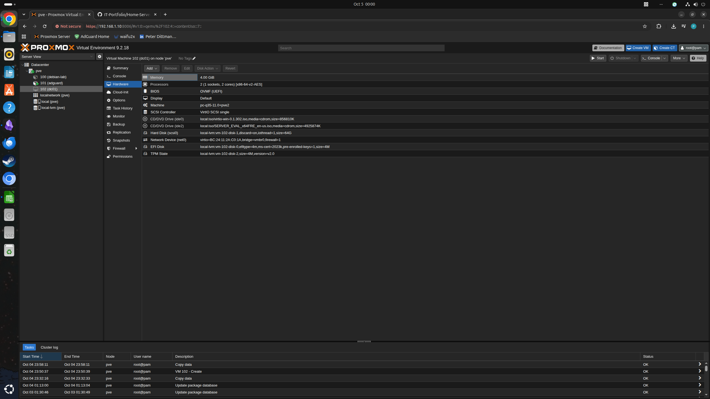
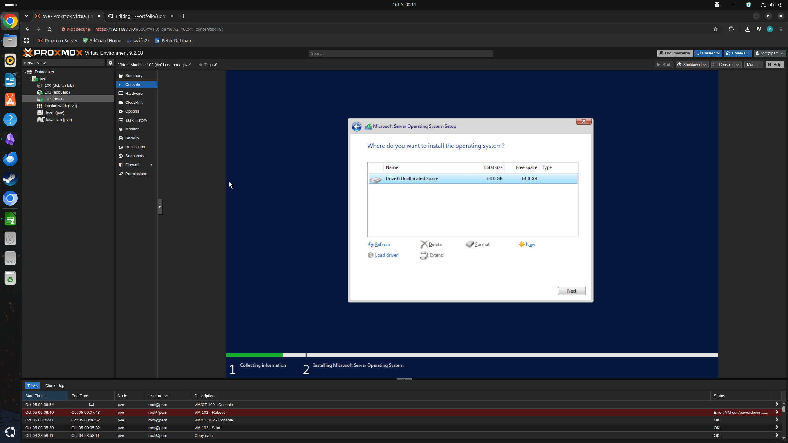

# Windows Domain Lab

## Objective

Expand my Proxmox home server into a small Windows domain
environment for practising Windows administration and common
IT support tasks.

The environment will include a Windows Server domain controller
and a Windows client so that I can practise Active Directory,
DNS, user and group administration, Group Policy, permissions,
domain joins, and troubleshooting.

## Environment

### Physical Host
- Hypervisor: Proxmox VE 9.2
- CPU: Intel Core i5-4570
- CPU configuration: 4 cores / 4 threads
- Memory: 16 GB DDR3-1600
- Storage: 500 GB HDD

### Existing Network
- LAN: 192.168.1.0/24
- Proxmox management: 192.168.1.10/24
- Gateway: 192.168.1.254
- Virtual bridge: vmbr0
- AdGuard Home: 192.168.1.11/24

## Phase 1 — Windows Server Deployment

### Objective

Deploy a Windows Server virtual machine on Proxmox and establish
a known-good baseline before installing Active Directory Domain
Services.

### Starting State

Proxmox is operational and existing Linux containers have
validated the host's storage, networking, and vmbr0 bridge.

### VM Creation

- VM ID: 102
- VM name: dc01
- Proxmox node: pve
- High availability: Disabled

The server was given the functional hostname `dc01` because it is
intended to become the first domain controller in the Windows lab.
High availability was not configured because this is a single-node
homelab rather than a clustered Proxmox environment.

The VM was provisioned with 2 vCPUs, 4 GB RAM, and a 64 GiB
virtual disk. Resources were intentionally limited because the
physical host has 4 CPU cores and 16 GB RAM and must also support
the existing Linux containers and a future Windows client VM.

Modern virtual hardware was selected using q35, UEFI, TPM 2.0,
VirtIO SCSI storage, and a VirtIO network adapter. The VM was
connected to the existing LAN through the Proxmox `vmbr0` bridge.

The VM was created without immediately starting it so that the
Windows VirtIO driver ISO could be attached before operating
system installation.

*DC01 virtual hardware configuration in Proxmox, including UEFI/TPM,
VirtIO storage and networking, and separate Windows Server and VirtIO
driver installation media.*

### VM Configuration

| Setting | Configuration | Reason |
|---|---|---|
| Operating system | TBD | |
| VM ID | TBD | |
| Hostname | TBD | |
| CPU | TBD | |
| Memory | TBD | |
| Disk | TBD | |
| Network bridge | vmbr0 | Connect VM to LAN |
| Network adapter | TBD | |
| Machine type | q35 | Modern virtual hardware platform |
| Firmware | OVMF (UEFI) | Provides modern UEFI firmware |
| EFI disk | local-lvm | Persists UEFI configuration |
| SCSI controller | VirtIO SCSI single | Paravirtualized storage controller |
| TPM | TPM 2.0 | Provides virtual TPM support |
| QEMU Guest Agent | Enabled | Allows host/guest management integration |
| System disk | 64 GiB, SCSI | Provides sufficient capacity for Windows Server, updates and AD lab services |
| Storage backend | local-lvm | Uses the Proxmox VM storage pool |
| SCSI controller | VirtIO SCSI single | Provides paravirtualized storage rather than legacy IDE emulation |
| Discard | Enabled | Allows unused blocks to be reclaimed by thin-provisioned storage |
| CPU | 1 socket, 2 cores (2 vCPUs) | Provides sufficient CPU resources for the small Windows Server lab while preserving host capacity for other guests |
| Memory | 4096 MiB (4 GB) | Provides adequate memory for the lab domain controller while preserving host resources for other guests |
| Network bridge | vmbr0 | Connects the VM to the existing LAN through the Proxmox virtual bridge |
| Network adapter | VirtIO | Uses a paravirtualized network interface designed for virtualized guests |
| VLAN | None | Lab currently uses the existing untagged LAN |

### Windows Server Installation:

Windows Server 2022 Standard Evaluation (Desktop Experience) was selected
for the domain controller. Standard provides the required Active Directory
and DNS functionality for the lab, while Desktop Experience provides the
graphical administration tools useful for practising common Windows Server
support and administration workflows.

#### VirtIO Storage Driver

During Windows Server installation, Windows Setup did not initially
detect the 64 GiB virtual system disk.

The disk had already been verified in the Proxmox hardware
configuration, indicating that the virtual disk itself existed. The VM
used a VirtIO SCSI controller, so the likely cause was that Windows
Setup did not have the required VirtIO storage driver loaded.

The VirtIO driver ISO had been attached to the VM before installation.
The Windows Server 2022 x64 VirtIO SCSI driver was loaded from:

`vioscsi/2k22/amd64`

After loading the driver, Windows Setup successfully detected the
64 GiB virtual disk.

*Windows Setup detecting the 64 GiB virtual system disk after the
Windows Server 2022 VirtIO SCSI driver was loaded.*

### Deployment

Document the significant configuration decisions and installation
steps here.

### Validation

Record the tests performed after installation and their results.

### Problems Encountered

Record symptoms, evidence, investigation, root cause and resolution.
Do not remove problems simply because they were resolved.

### Result

To be completed after validation.

### Lessons Learned

To be completed after deployment.
