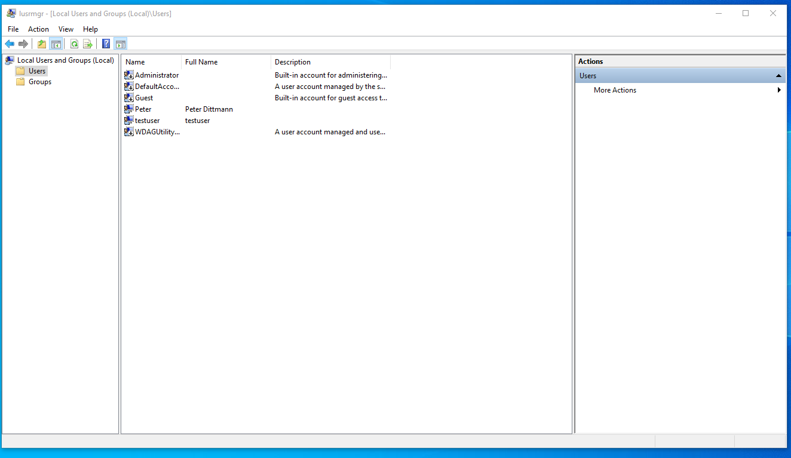
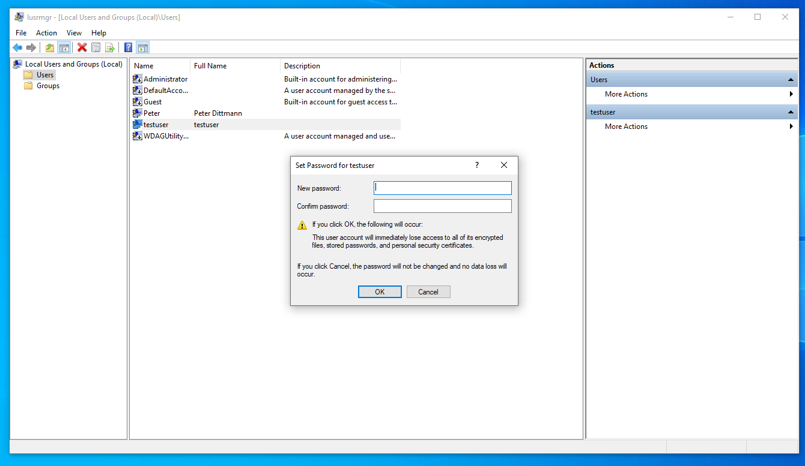
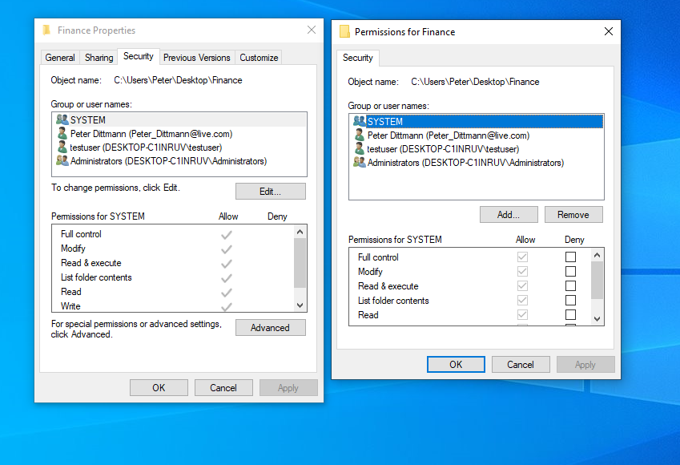
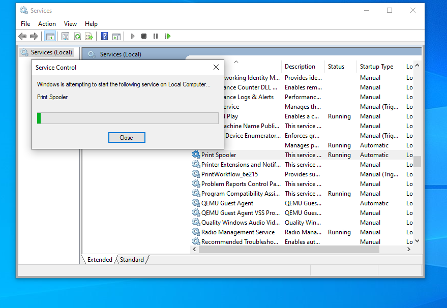
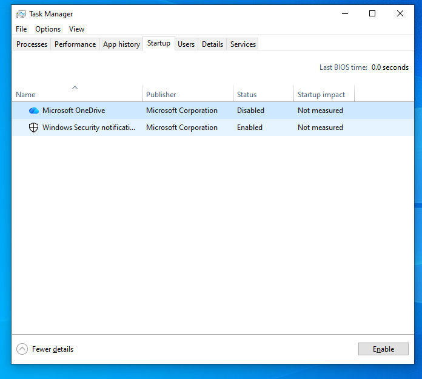
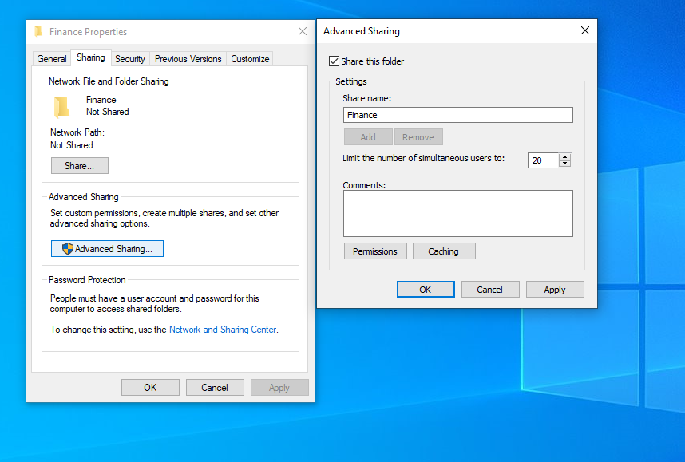

# IT Support Lab: Windows User, Access, and Troubleshooting Scenarios

## Project Summary

Hands-on IT Support lab demonstrating real-world troubleshooting across Windows and Linux environments. Demonstrated a structured troubleshooting methodology to diagnose issues, apply targeted fixes, and verify successful resolution.

## Objective

The goal of this project was to build practical experience in common IT support scenarios within a Windows environment, focusing on user account management, access control, service troubleshooting, and system performance issues.

This project was designed to simulate real help desk tasks and demonstrate the ability to diagnose issues, apply solutions, and document the process clearly.

## Environment

- **Host OS:** Ubuntu Linux
- **Virtualization:** QEMU/KVM (virt-manager)
- **Guest OS:** Windows 10/11
- **Machine Name:** Win10
- **User Types:** Administrator and Standard Users

##  Key Scenarios

- Resolved NTFS permission issues and restored user access
- Diagnosed DNS failures (IP connectivity vs hostname resolution)
- Restarted and validated Windows services (Print Spooler)
- Configured Linux users and sudo permissions
- Deployed Docker container with secure remote access (Cloudflare Tunnel)
- Implemented firewall rules using UFW

##  Tools & Technologies

- Windows 10 / Windows Server
- Linux (Ubuntu)
- Active Directory (concepts)
- Command Line (CMD / Bash)
- Networking (DNS, IP, ICMP)
- Docker
- Cloudflare Tunnel
- UFW Firewall

## Lab Overview

A Windows virtual machine was configured to simulate a real user environment, including multiple user accounts, file structures, and common system configurations.

Various issues were intentionally created to replicate common help desk tickets, including login failures, permission issues, shared resource access problems, printer service interruptions, and performance slowdowns.

This lab was designed to reflect real-world help desk scenarios where users experience access issues, service failures, and performance problems requiring structured diagnosis and resolution.

## Scenarios Implemented

### Scenario 1: Password Reset and Account Access

**Symptoms:** 
User reported inability to log in due to incorrect or forgotten password.

**Investigation:** 
Attempted login failed. Verified account existed and system was operational.

**Cause:** 
Incorrect or unknown password.

**Resolution:** 
Reset the user password using administrator privileges.

**Verification:** 
User successfully logged in with updated credentials.

### Scenario 2: Folder Permission / Access Denied

**Symptoms:** 
User receives "Access Denied" when attempting to open a folder.

**Investigation:** 
Checked folder security settings and user permissions.

**Cause:** 
User did not have required permissions for the folder.

**Resolution:** 
Modified folder permissions to grant appropriate access.

**Verification:** 
User successfully accessed the folder.

### Scenario 3: Shared Folder Access Issue

**Symptoms:** 
User unable to access a shared folder.

**Investigation:** 
Checked sharing settings and user permissions.

**Cause:** 
Mismatch between sharing permissions and security permissions.

**Resolution:** 
Adjusted both sharing and NTFS permissions.

**Verification:** 
User successfully accessed shared resource.

### Scenario 4: Printer Queue / Service Issue

**Symptoms:** 
Print jobs stuck in queue and not completing.

**Investigation:** 
Checked printer queue and system services.

**Cause:** 
Print Spooler service required restart.

**Resolution:** 
Cleared print queue and restarted Print Spooler service.

**Verification:** 
Print jobs completed successfully.

### Scenario 5: Slow Startup / Performance Issue

**Symptoms:** 
System experiencing slow startup and performance issues.

**Investigation:** 
Reviewed startup applications in Task Manager.

**Cause:** 
Multiple unnecessary startup applications.

**Resolution:** 
Disabled non-essential startup programs.

**Verification:** 
System startup time improved.

## Validation and Testing

The following validation steps were completed:

- Verified user account functionality and login access
- Confirmed permission changes resolved access issues
- Verified shared folder accessibility
- Confirmed printer service functionality after restart
- Verified system performance improvements after startup optimization

## Troubleshooting Approach

Each scenario followed a structured troubleshooting approach:

1. Identify symptoms
2. Gather relevant system information
3. Isolate the root cause
4. Apply a targeted fix
5. Verify resolution

This approach ensured consistent and effective problem-solving across different issue types.

## Key Skills Demonstrated

- Windows administration
- User account management
- Password reset procedures
- File and folder permissions
- Shared resource configuration
- Printer service troubleshooting
- System performance analysis
- Structured troubleshooting methodology
- Technical documentation

## Key Takeaways

This project developed practical experience in diagnosing and resolving common end-user issues within a Windows environment. It reinforced the importance of structured troubleshooting, clear communication, and validating solutions after implementation.

The most valuable takeaway was learning to approach problems methodically rather than relying on guesswork.

## Evidence / Screenshots

## 1. User Account Management

> Multiple user accounts configured to simulate a real support environment, including administrator and standard user roles.

---

## 2. Password Reset Scenario

> Administrator resetting user credentials to restore account access.

---

## 3. Folder Permission Configuration

> Folder access restricted and modified to resolve access issues.

---

## 4. Printer Queue and Service

> Printer queue cleared and spooler service restarted.

---

## 5. Startup Performance Optimization

> Startup programs reviewed and optimized to improve performance.

---

## 6. Shared Folder Configuration

> Folder configured with sharing enabled and permissions adjusted to allow user access across accounts.
## Resume Bullet Points

- Simulated a Windows IT support environment to perform user account management, access control, and system troubleshooting.
- Resolved common help desk issues including password resets, permission errors, shared resource access, and printer service failures.
- Applied structured troubleshooting methodology to identify root causes and validate solutions.
- Improved system performance by analyzing and optimizing startup applications.
- Documented support scenarios using clear, repeatable processes aligned with real-world IT workflows.

> [!success] Why This Project Matters
> This project reinforced the importance of clear problem identification, methodical troubleshooting, and verifying solutions before closing a support task.

