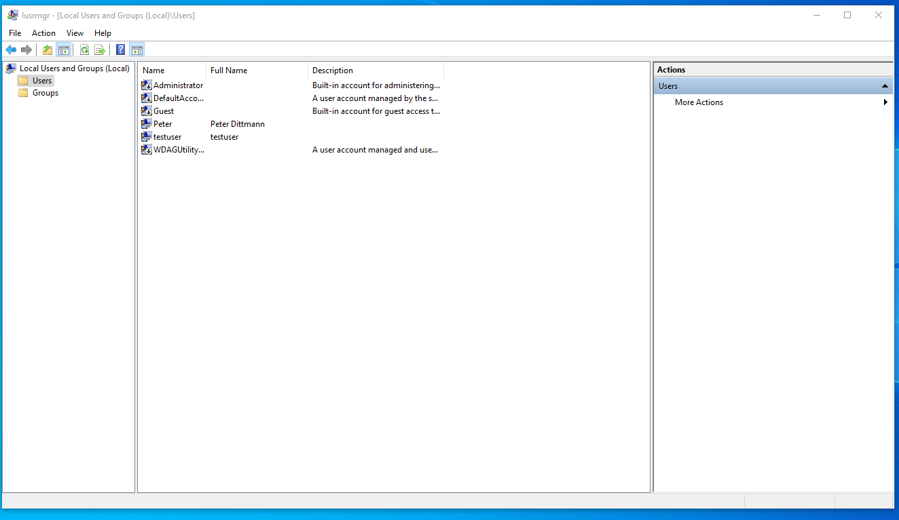
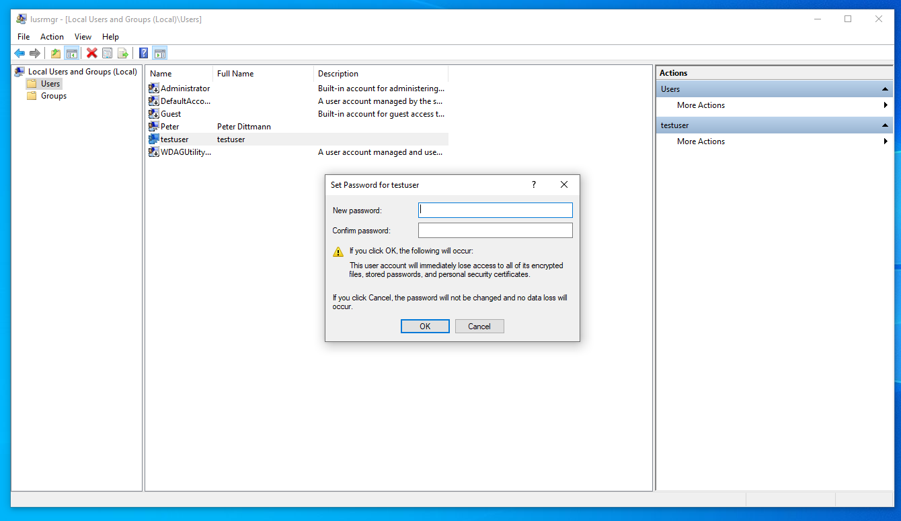
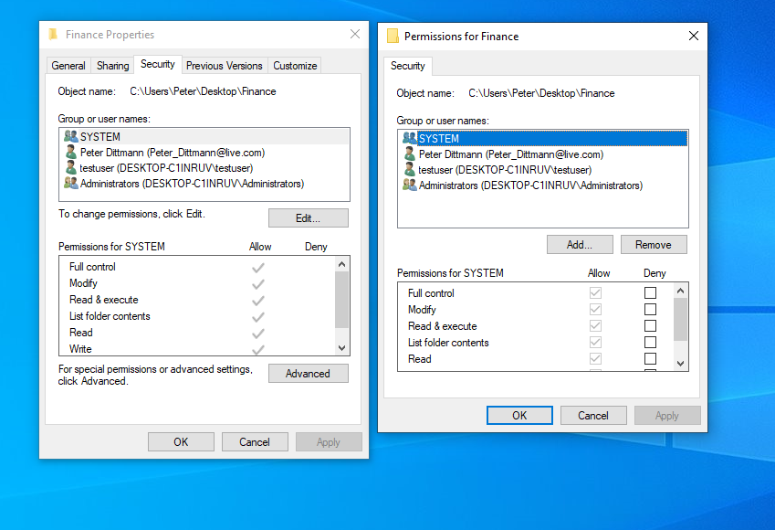
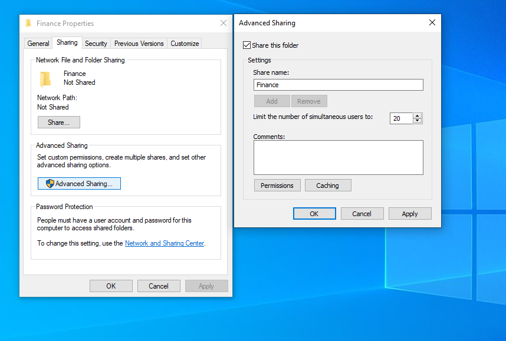
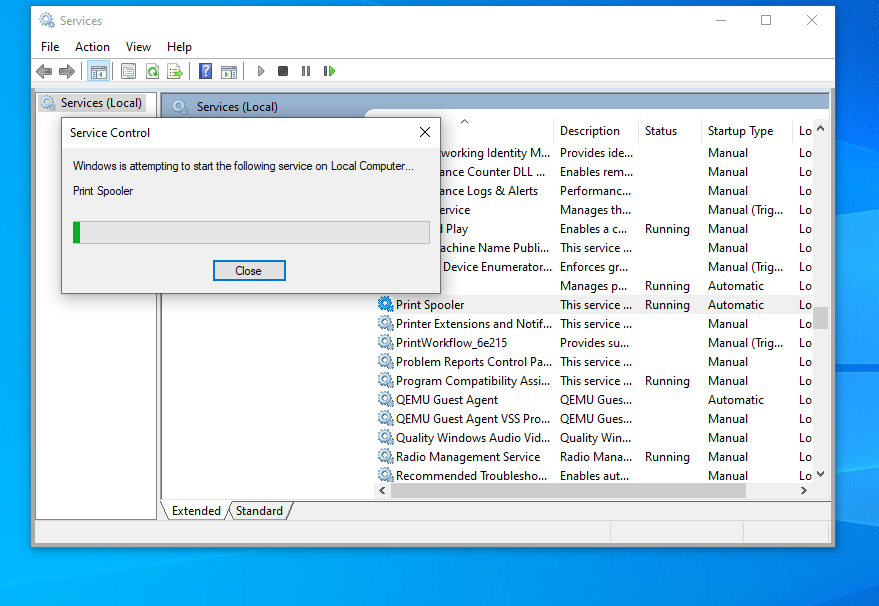
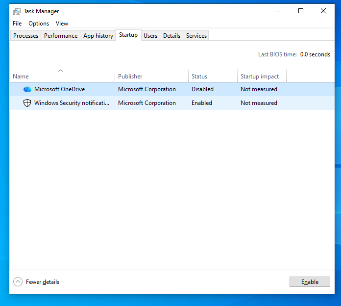

# IT Support Lab – Windows User, Access & Troubleshooting Scenarios

## Project Overview

Built a Windows support lab to practise common Help Desk and Desktop Support tasks involving user accounts, access permissions, shared resources, Windows services, and system performance.

I intentionally created several common end-user problems in a virtual Windows environment, investigated each issue, applied a targeted resolution, and verified that the problem was resolved.

The purpose of the lab was to develop a repeatable troubleshooting process rather than simply applying fixes without understanding the problem.

---

## Environment

| Component | Configuration |
| --- | --- |
| Host OS | Ubuntu Linux |
| Virtualization | QEMU/KVM with virt-manager |
| Guest OS | Windows 10/11 |
| Machine Name | `Win10` |
| User Types | Administrator and Standard Users |

---

## Lab Setup

The Windows virtual machine was configured with administrator and standard user accounts along with folders, shared resources, Windows services, and startup applications that could be used to create support scenarios.

The issues in this lab were intentionally introduced so that I could practise identifying symptoms, investigating likely causes, applying changes, and verifying the result.

### User Account Environment

> Multiple Windows user accounts configured with administrator and standard-user roles for the support scenarios.

---

# Support Scenarios

## 1. Password Reset and Account Access

### Initial Report

A user is unable to sign in because the current password is incorrect or has been forgotten.

### Investigation

Confirmed that the login attempt failed, verified that the user account existed, and confirmed that the Windows system itself was operational.

### Finding

The account was valid, but the correct password was not available to the user.

### Resolution

Used administrator privileges to reset the password for the affected account.

### Verification

Successfully signed in using the affected user account with the updated credentials.

### Evidence

> Administrator account used to reset user credentials and restore account access.

---

## 2. Folder Permission – Access Denied

### Initial Report

A user receives an **Access Denied** message when attempting to open a folder.

### Investigation

Reviewed the folder's Windows security settings and checked the permissions assigned to the affected user.

### Finding

The user did not have the permissions required to access the folder.

### Resolution

Modified the folder permissions to provide the required access.

### Verification

Tested the folder using the affected account and confirmed that the user could access it successfully.

### Evidence

> Windows folder security settings reviewed and modified to restore the required user access.

---

## 3. Shared Folder Access Issue

### Initial Report

A user is unable to access a shared folder.

### Investigation

Reviewed both the folder's sharing configuration and its Windows security permissions.

### Finding

The share permissions and NTFS security permissions did not provide the user with the required access.

### Resolution

Adjusted the sharing and NTFS permissions to provide the appropriate access.

### Verification

Retested the shared resource and confirmed that the affected user could access it successfully.

### Evidence

> Shared-folder configuration and permissions adjusted to allow the required user access.

---

## 4. Printer Queue and Print Spooler Issue

### Initial Report

Print jobs remain stuck in the print queue and do not complete.

### Investigation

Reviewed the print queue and checked the Windows services involved in processing print jobs.

### Finding

The Print Spooler service required a restart.

### Resolution

Cleared the affected print queue and restarted the Windows Print Spooler service.

### Verification

Confirmed that print jobs could process successfully after the service was restarted.

### Evidence

> Print queue cleared and Windows Print Spooler service restarted as part of troubleshooting the printing issue.

---

## 5. Slow Startup and Performance Issue

### Initial Report

The Windows system is experiencing slow startup and reduced performance.

### Investigation

Reviewed the applications configured to launch automatically using Windows Task Manager.

### Finding

Multiple unnecessary applications were configured to run during startup.

### Resolution

Disabled non-essential startup applications.

### Verification

Restarted and retested the system and observed improved startup performance.

### Evidence

> Startup applications reviewed in Task Manager and unnecessary startup items disabled.

---

# Troubleshooting Method

Each scenario followed the same general troubleshooting process:

1. **Identify the reported problem**  
   Establish what the user or system is experiencing.

2. **Gather information**  
   Check the affected account, configuration, service, permissions, or system state.

3. **Narrow down the cause**  
   Use the available information to determine which component is responsible for the problem.

4. **Apply a targeted change**  
   Make the change required to address the identified issue rather than changing unrelated settings.

5. **Verify the result**  
   Retest the original problem using the affected account, service, or system.

6. **Document the outcome**  
   Record what caused the problem, what was changed, and how the resolution was verified.

This process helped reinforce the importance of verifying a solution instead of assuming that making a configuration change resolved the original problem.

---

# Support Relevance

The scenarios in this lab represent several types of tasks commonly associated with entry-level Windows support:

- User account and password support
- Access troubleshooting
- File and folder permissions
- Shared-resource troubleshooting
- Windows service troubleshooting
- Printer and print-queue troubleshooting
- Startup and performance troubleshooting
- Administrator and standard-user accounts
- Testing changes from the affected user's perspective
- Documenting troubleshooting and resolution steps

This is a simulated lab environment rather than professional Help Desk experience. It gives me a controlled environment where I can practise troubleshooting Windows problems and develop a consistent process for diagnosing and resolving user issues.

---

# Skills Practised

## Windows Support

- Windows 10/11
- Windows user administration
- Administrator and standard-user accounts
- Windows Task Manager
- Windows services
- Print Spooler troubleshooting

## Access & Permissions

- Password resets
- User account access
- File and folder permissions
- NTFS permissions
- Shared-folder configuration
- Share permissions

## Troubleshooting

- Gathering symptoms
- Reviewing system configuration
- Isolating likely causes
- Applying targeted changes
- Testing from the affected user's perspective
- Verifying resolution
- Technical documentation

---

# What I Learned

The most important lesson from this lab was that resolving a support issue requires more than finding a setting that appears incorrect.

The original problem needs to be reproduced or understood, the relevant configuration needs to be investigated, and the result needs to be tested after a change is made.

The shared-folder scenario also reinforced the difference between **share permissions and NTFS permissions**. Access to a shared resource can depend on both layers, so troubleshooting only one set of permissions may not explain why a user cannot access the resource.

The scenarios also reinforced the value of testing a resolution from the affected user's perspective. An administrative change is not complete simply because it was successfully applied; the original problem should be retested to confirm that the user can perform the required task.

---

# Next Steps

I plan to expand this support work as the Windows environment in my Home Server Lab develops.

Future scenarios will be documented only as they are completed and may include:

- Active Directory password resets and account lockouts
- Domain-user access problems
- Security-group membership and resource access
- DNS-related domain connectivity issues
- Group Policy troubleshooting
- File-server and shared-folder support
- Windows service failures
- Additional printer and peripheral troubleshooting
- Basic PowerShell-assisted troubleshooting
- Support scenarios requiring escalation rather than direct resolution

For future scenarios, I also plan to document more of the diagnostic reasoning behind each step, including what information was gathered, what possible causes were considered, and why a particular troubleshooting path was selected.
