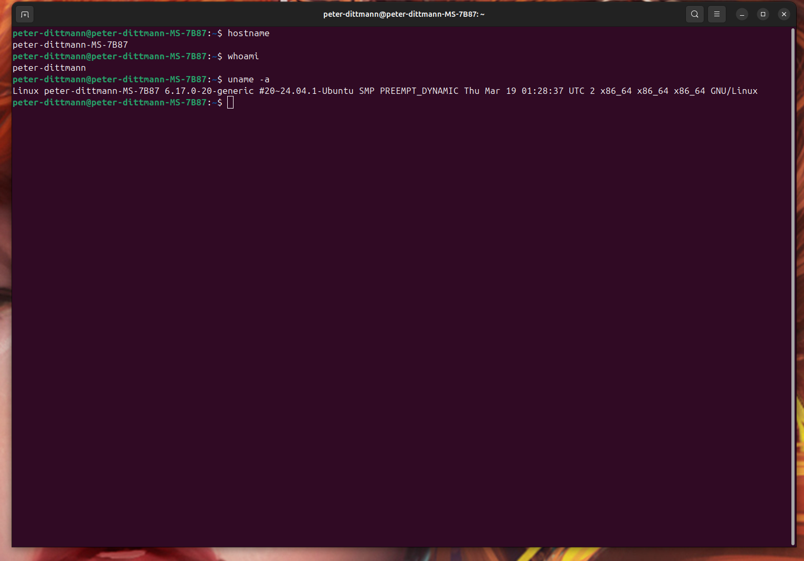
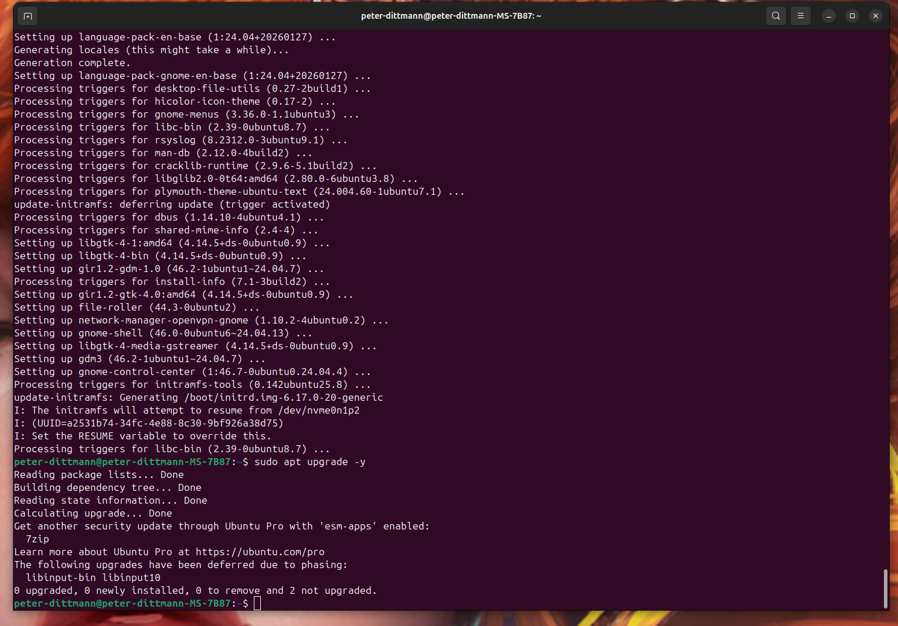
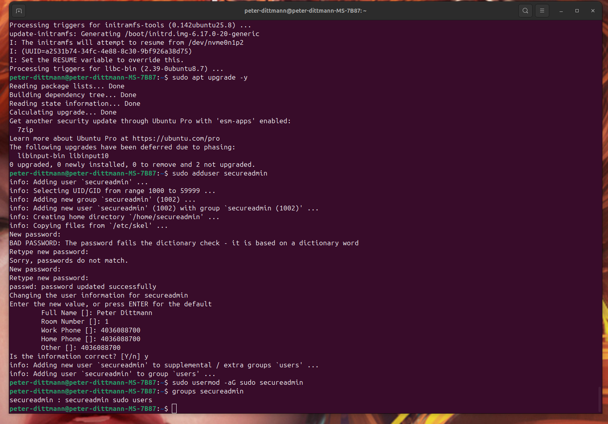
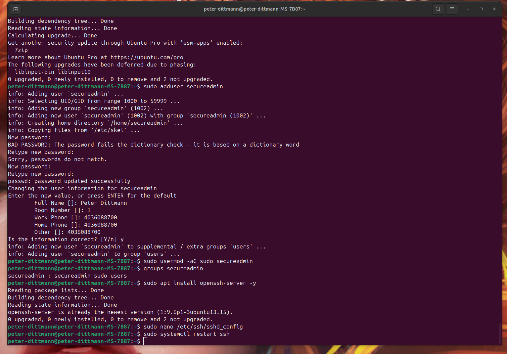
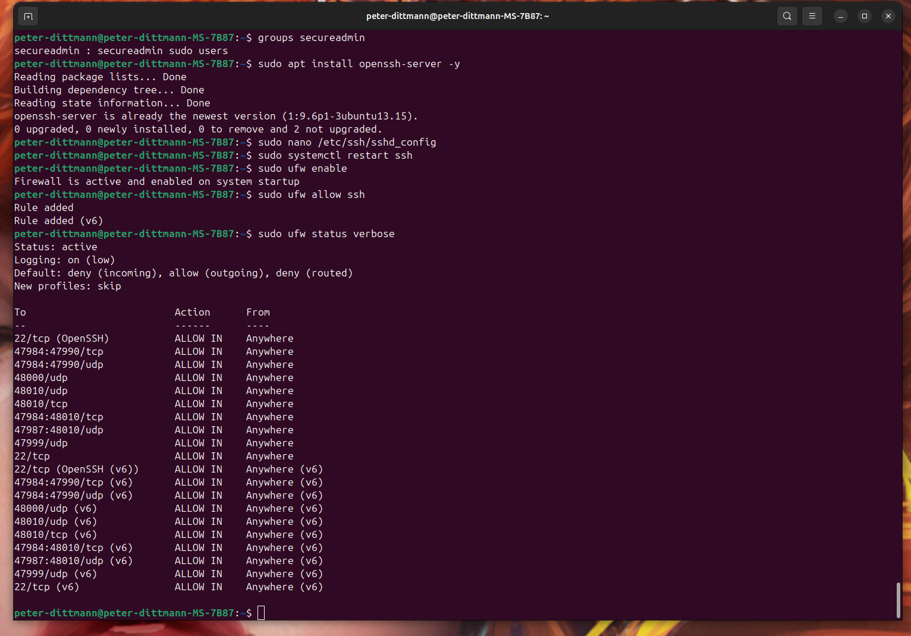
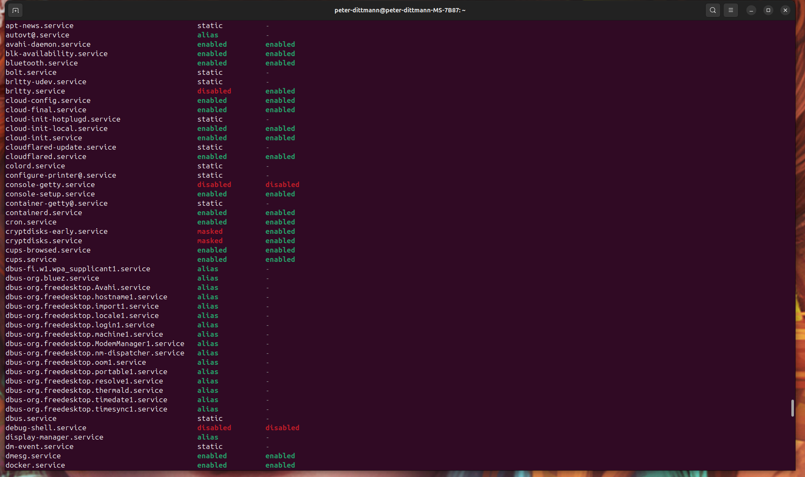
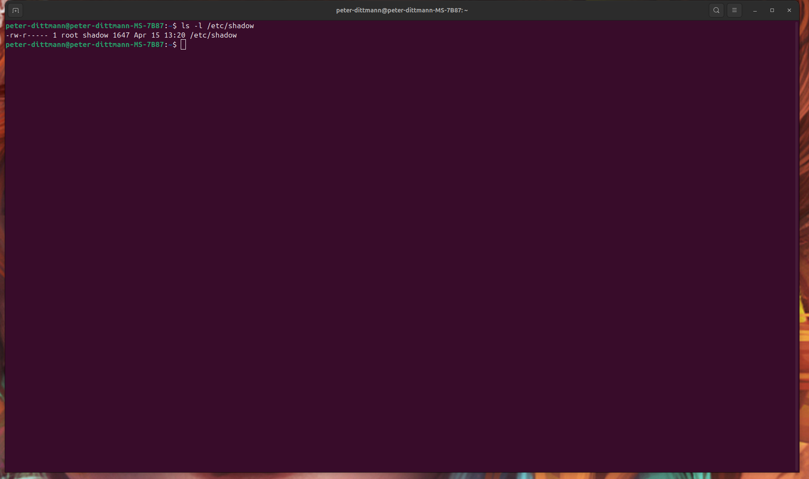
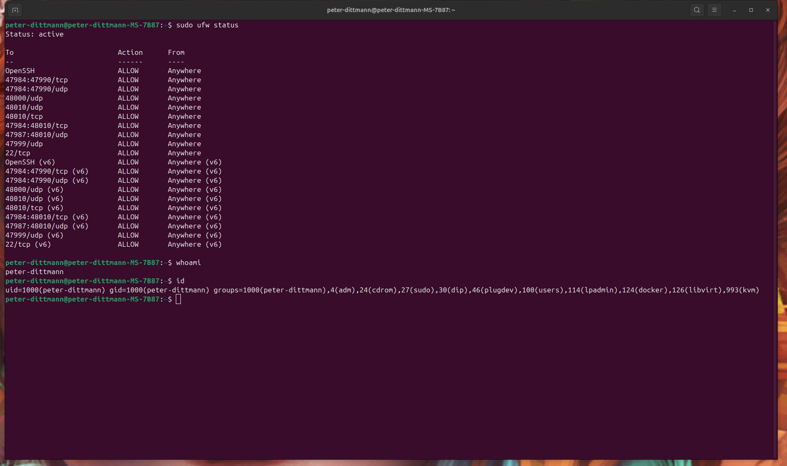

# Linux System Hardening Lab

> This project demonstrates practical Linux system hardening techniques used to secure endpoints in real-world IT environments.

## Project Summary

Hardened an Ubuntu Linux system by implementing security best practices including user access control, SSH configuration, firewall rules, and service management. This project simulates real-world system administration tasks focused on reducing system attack surface and enforcing secure configurations.

---

## Objective

The objective of this project was to gain practical experience in securing a Linux system by applying industry-standard hardening techniques and validating system integrity through configuration and testing.

---

## Environment

- OS: Ubuntu Linux (24.04)
- Host System: Personal workstation
- Interface: Terminal (CLI-based administration)
- User Context: Non-root user with sudo privileges

---

## Key Tasks Performed:

- Configured SSH access securely
- Disabled insecure login methods
- Implemented firewall rules (UFW)
- Managed user privileges and sudo access

---

## Tools Used:

- Bash terminal
- SSH
- UFW
  
---

## Initial System State

Captured baseline system configuration prior to applying hardening measures, including system identity, kernel version, and active user context.

---

## System Updates and Patching

Updated all system packages using `apt` to ensure the system is protected against known vulnerabilities and running the latest stable versions of installed software.

---

## User and Access Control

Created a non-root administrative user (`secureadmin`) and assigned sudo privileges. This reduces reliance on the root account and follows the principle of least privilege.

---

## SSH Hardening

Modified SSH configuration to disable root login and enforce controlled remote access. Restarted SSH service to apply changes and ensure configuration integrity.

Key changes:
- Disabled root login (`PermitRootLogin no`)
- Maintained password authentication for lab usability

---

## Firewall Configuration

Enabled and configured UFW (Uncomplicated Firewall) to restrict incoming connections to only essential services. Explicitly allowed SSH while denying all other unsolicited traffic.

---

## Service Hardening

Reviewed active system services and disabled unnecessary services to reduce potential attack vectors and system exposure.

---

## File Permissions and Security

Reviewed critical system files such as `/etc/shadow` to verify proper permission settings. Confirmed access is restricted to root and authorized system groups only.

---

## System Monitoring and Validation

Validated system hardening measures through command-line checks, ensuring:
- Firewall rules are active
- User permissions are correctly applied
- Secure configurations persist after changes

---

## Key Skills Demonstrated

- Linux system administration  
- User and privilege management  
- SSH configuration and hardening  
- Firewall configuration (UFW)  
- Service management (systemctl)  
- File permission auditing  
- System validation and troubleshooting  

---

## Key Takeaways

- Proper DNS and service configuration are critical to system security  
- Limiting root access significantly reduces attack risk  
- Disabling unnecessary services minimizes system exposure  
- Firewall rules provide essential control over network access  
- Small configuration changes can have significant security impact  

---

## Troubleshooting Notes

- Verified correct SSH configuration syntax before restarting service to prevent lockout  
- Ensured firewall rules allowed SSH access before enabling UFW  
- Confirmed user group membership after privilege assignment  
- Validated permissions using `ls -l` to ensure proper access control  

---

## Evidence / Screenshots

### Initial System State

> Baseline system configuration showing hostname, active user, and kernel version prior to hardening.

---

### System Updates and Patching

> Updated system packages to ensure latest security patches were applied.

---

### User and Access Control

> Created a non-root administrative user and assigned sudo privileges.

---

### SSH Hardening

> Modified SSH configuration to disable root login and enforce secure access.

---

### Firewall Configuration

> Enabled UFW firewall and allowed only required services.

---

### Service Hardening

> Identified and disabled unnecessary system services.

---

### File Permissions and Security

> Verified secure permissions on sensitive system files such as /etc/shadow.

---

### System Monitoring and Validation

> Confirmed firewall status, user privileges, and system configuration integrity.

---

## Resume Bullet Points

- Hardened an Ubuntu Linux system by implementing secure user management, SSH configuration, and firewall rules  
- Configured UFW firewall to restrict system access and reduce attack surface  
- Disabled unnecessary services to minimize potential security vulnerabilities  
- Verified and audited system file permissions to protect sensitive data  
- Documented system configuration, validation steps, and troubleshooting processes in a structured lab environment  
