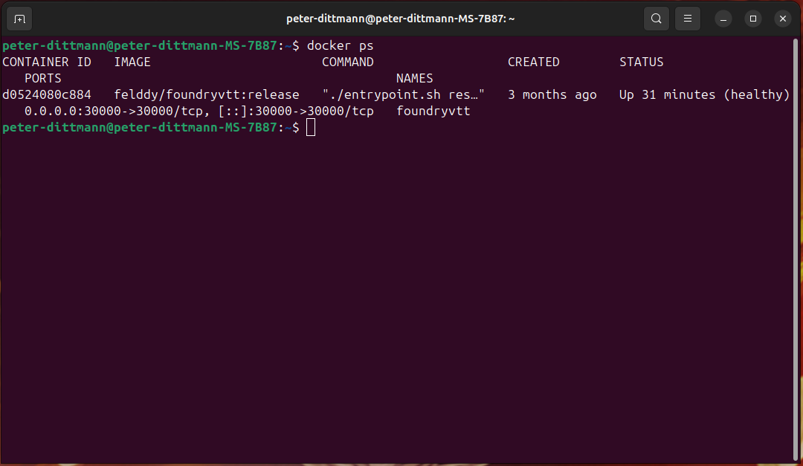
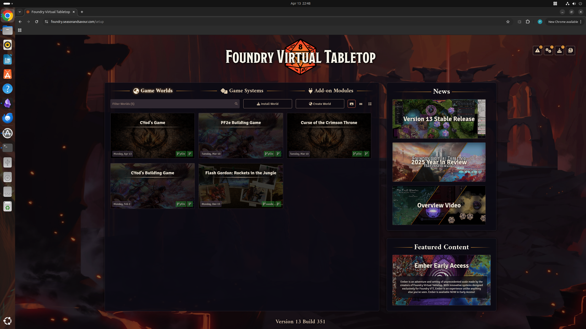
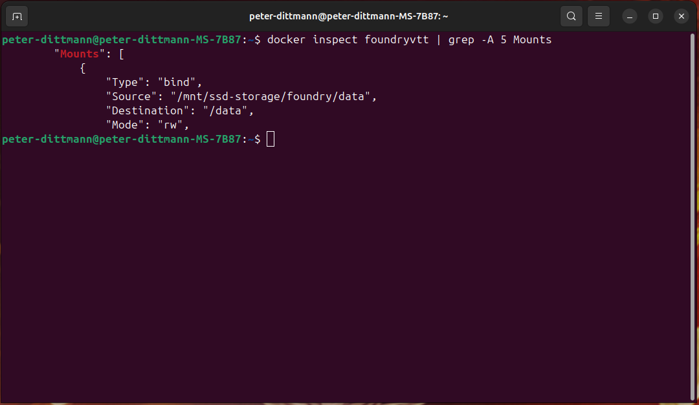
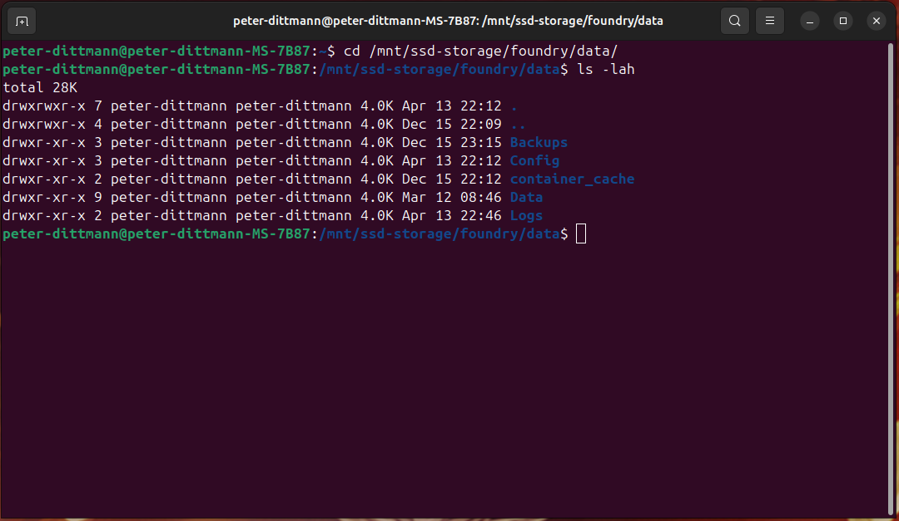
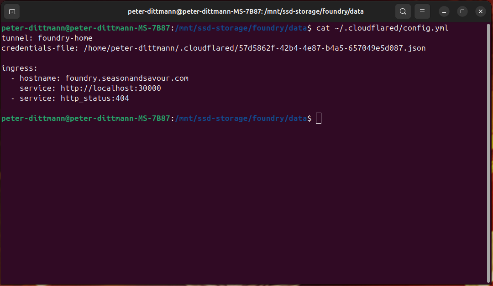
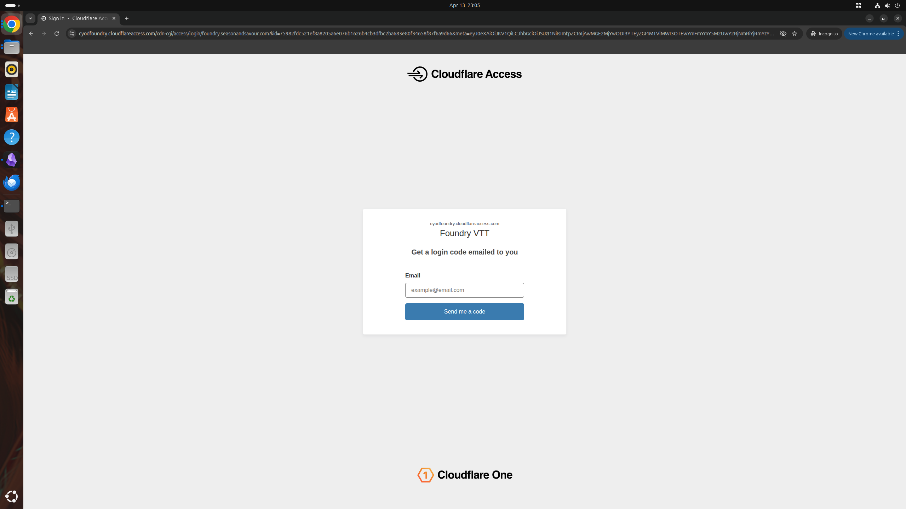
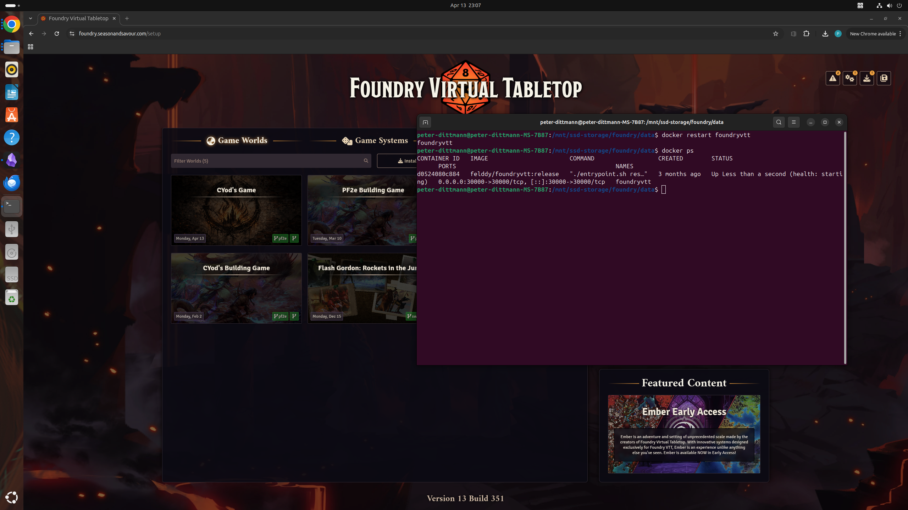

# Secure Remote Application Hosting with Docker and Cloudflare Tunnel

## Project Summary

Deployed and secured a containerized web application on a Linux host using Docker, implementing persistent storage, automated service restart, and authenticated remote access via Cloudflare Tunnel. Validated system reliability, port behavior, and data persistence through structured testing and troubleshooting.

This setup mirrors a production-style deployment where service availability, secure access, and data persistence must be maintained without exposing internal infrastructure.

## Objective

The goal of this project was to deploy and maintain a self-hosted web application in a Linux environment, provide secure remote access without traditional port forwarding, and ensure the application remained reliable through persistent storage and automatic restart behavior.

This project was also used to demonstrate practical entry-level IT skills in Linux administration, Docker, networking, access control, troubleshooting, and documentation.

## Environment

- **Host OS:** Ubuntu Linux
- **Containerization:** Docker
- **Application:** Foundry VTT
- **Local Service Port:** 30000
- **Remote Access:** Cloudflare Tunnel
- **Authentication:** Cloudflare Access
- **Data Storage Path:** `/mnt/ssd-storage/foundry/data`
- **Container Data Path:** `/data`

## Architecture Overview

The application runs locally inside a Docker container on the Linux host and listens on port 30000. Remote traffic is routed through Cloudflare Tunnel from a public subdomain to the internal service, allowing secure external access without exposing local ports on the router.

Application data is stored on the host system using a Docker bind mount. This keeps configuration files, logs, backups, and world data separate from the container itself, ensuring persistence across container restarts or redeployments.

## Deployment Process

### 1. Environment Preparation

Prepared the Linux host environment by confirming Docker functionality, verifying the application storage location, and organizing the directory structure used for persistent application data.

This ensured the environment was ready for container deployment and long-term service use.

### 2. Container Deployment

Deployed the application in a Docker container and mapped the service to port 30000 for local access. Confirmed the container was running successfully and validated local application access through `127.0.0.1:30000`.

This established the application as a locally accessible containerized service.

### 3. Persistent Storage Configuration

Configured a Docker bind mount to map the host directory `/mnt/ssd-storage/foundry/data` to `/data` inside the container. This ensured that important application data remained stored on the host instead of inside the container filesystem.

The host data directory contains application components such as configuration files, logs, backups, cached data, and world data.

### 4. Secure Remote Access Configuration

Configured Cloudflare Tunnel to securely route traffic from a public subdomain to the local application service on port 30000. This allowed remote access without requiring direct router port forwarding.

This approach reduced public exposure while maintaining reliable remote connectivity.

### 5. Access Control Implementation

Applied authentication controls through Cloudflare Access to restrict who could reach the application externally. This added an identity-based security layer in front of the service and helped prevent unauthorized access.

### 6. Service Persistence and Reliability

Configured the container to run persistently in the background and automatically restart when appropriate. Verified that the service remained available after restart testing and continued to load both locally and through the public subdomain.

This improved reliability and better reflected real-world service management practices.

This approach separates application state from the container lifecycle, allowing the container to be recreated or updated without data loss.

## Validation and Testing

The following validation steps were completed:

- Confirmed the container was running using Docker
- Verified local access through `127.0.0.1:30000`
- Verified remote access through the public subdomain
- Confirmed Docker bind mount configuration for persistent storage
- Verified host-side data existed in `/mnt/ssd-storage/foundry/data`
- Confirmed data remained intact after restart testing
- Verified the application continued to function after restart
- Confirmed secure routing through Cloudflare Tunnel
- Confirmed access control behavior for remote access

## Troubleshooting and Issues Encountered

### Issue 1: Localhost Access vs Default Port

**Symptoms:** 
The application did not load when accessed through `127.0.0.1`, but it did load through the public subdomain.

**Investigation:** 
Reviewed the container configuration and verified the exposed service port using Docker. Confirmed the application was listening on port 30000 rather than the default HTTP port 80.

**Cause:** 
Accessing `127.0.0.1` without a port attempts to use port 80. The application was configured on `127.0.0.1:30000`.

**Resolution:** 
Tested the application using `127.0.0.1:30000` and confirmed successful local access.

**Verification:** 
Application loaded successfully both locally on port 30000 and remotely through the Cloudflare-routed subdomain.

### Issue 2: Persistent Storage Verification

**Symptoms:** 
Needed to verify that application data was stored on the host rather than being isolated only inside the container.

**Investigation:** 
Used Docker inspection to confirm a bind mount from `/mnt/ssd-storage/foundry/data` on the host to `/data` inside the container. Then navigated to the host directory and reviewed the stored files and folders.

**Cause:** 
Persistent storage needed to be verified to ensure configuration, logs, backups, and world data would survive container restarts.

**Resolution:** 
Confirmed host-side storage contained active application directories including `Backups`, `Config`, `Data`, `Logs`, and `container_cache`.

**Verification:** 
Validated that these files remained intact and accessible after restart testing.

### Issue 3: Service Persistence After Restart

**Goal:** 
Confirm that the application continued running reliably after restart events.

**Investigation:** 
Restarted the container and re-checked service availability locally and remotely.

**Resolution:** 
Confirmed the container continued running as expected and the application remained accessible through both local and remote methods.

**Verification:** 
Validated continued application availability after restart and confirmed data integrity was preserved.

## Key Skills Demonstrated

- Linux administration
- Docker container deployment and management
- Bind mounts and persistent storage
- Port mapping and local service validation
- Secure remote access with Cloudflare Tunnel
- Access control and authentication
- Service persistence and restart validation
- Troubleshooting and root cause analysis
- Technical documentation

## Key Takeaways

This project strengthened my understanding of how containerized services interact with host networking, persistent storage, and remote access tools. I gained practical experience validating port behavior, confirming host-based data persistence, and documenting a system in a way that reflects real IT support and junior system administration work.

The most valuable takeaway was learning to verify not just that a service works, but why it works, how it persists, and how it behaves after restart or access-related testing.

## Evidence / Screenshots

## 1. Docker Container Running

> Verified container is running and accessible via Docker.

---

## 2. Local Application Access on Port 30000

> Confirmed application is accessible locally via configured port.

---

## 3. Remote Access Through Public Subdomain

> Verified external access through Cloudflare Tunnel without exposing local ports.

---

## 4. Docker Bind Mount Configuration

> Confirmed host-to-container bind mount for persistent storage.

---

## 5. Host Data Directory Showing Persistent Storage

> Verified application data is stored on host system outside the container.

---

## 6. Cloudflare Tunnel Configuration

> Configured secure routing from public domain to internal service.

---

## 7. Access Control / Authentication

> Implemented authentication layer to restrict external access.

---

## 8. Post-Restart Validation

> Verified service persistence and functionality after restart.

## Resume Bullet Points

- Deployed and managed a containerized web application using Docker with persistent host-based storage.
- Implemented secure remote access using Cloudflare Tunnel, eliminating the need for direct port forwarding.
- Applied authentication controls to restrict external access and improve security.
- Validated service availability, port binding, and data persistence through structured testing.
- Diagnosed and resolved networking and configuration issues related to port access and container behavior.

> [!success] Why This Project Matters
>This project developed practical experience in containerized service deployment, secure remote access, and system validation within a Linux environment.
