# Troubleshooting Playbook

## Project Summary

Simulated real-world IT support scenarios within a Windows environment to diagnose and resolve common user issues including network failures, DNS problems, system performance degradation, permission errors, service failures, and storage limitations. Applied a structured troubleshooting methodology to identify root causes, implement targeted fixes, and verify successful resolution.

This project reflects real help desk workflows where issues must be diagnosed efficiently, resolved accurately, and documented clearly for future reference.

---

## Objective

The goal of this project was to simulate real-world IT support scenarios and demonstrate the ability to diagnose, resolve, and document common technical issues using a structured troubleshooting methodology.

---

## Environment

- Host OS: Ubuntu Linux
- Virtualization: QEMU/KVM (virt-manager)
- Guest OS: Windows 10
- Tools Used: Command Prompt, Task Manager, Services, Network Settings

---

**Key Issues Resolved:**

- DNS resolution failure (IP working, hostname failing)
- NTFS permission issues blocking access
- Print spooler service failure
- Network connectivity validation

---

**Tools Used:**

- Command Prompt (ping, ipconfig)
- services.msc
- File Explorer (permissions)

---

## Troubleshooting Methodology

Each issue was approached using a structured troubleshooting process:

1. Identify the problem  
2. Gather relevant system information  
3. Isolate the root cause  
4. Apply a targeted fix  
5. Verify resolution  

---

## Scenarios

---

### Issue 1: No Internet Connectivity

**Symptoms:**  
User reported an issue where internet connectivity was unavailable and inability to access websites.

**Investigation:**  
Checked network adapter status and verified IP configuration using `ipconfig`.

**Cause:**  
Network adapter was disabled, preventing system from obtaining an IP address.

**Resolution:**  
Re-enabled the network adapter and renewed the IP configuration using `ipconfig /renew`.

**Verification:**  
Confirmed successful internet connectivity by pinging an external domain.

#### Problem Identified
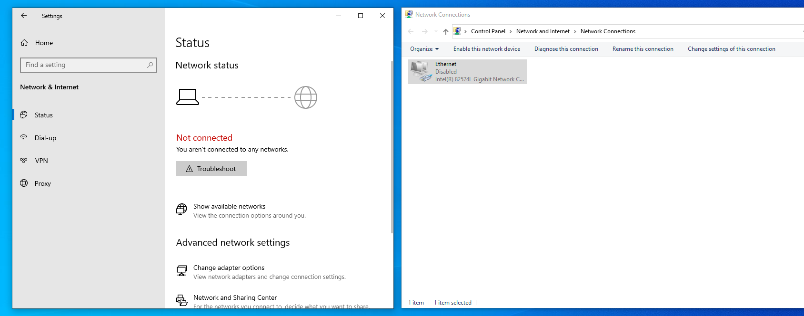

> Network adapter disabled, resulting in no connectivity.

#### Investigation
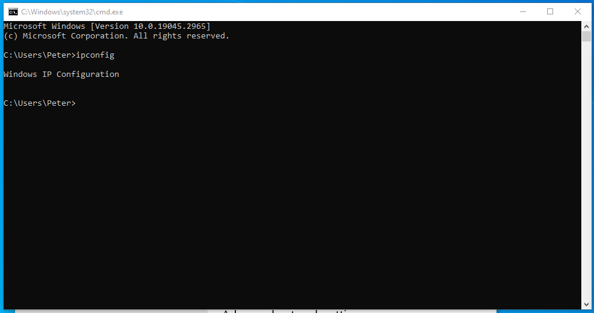

> System showing no valid IP configuration.

#### Resolution
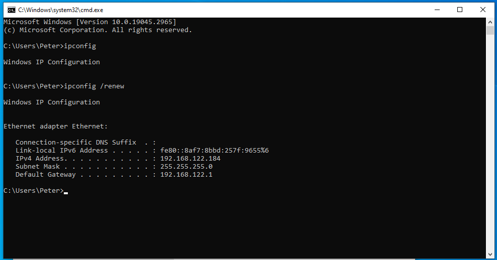

> IP configuration renewed after enabling adapter.

#### Verification
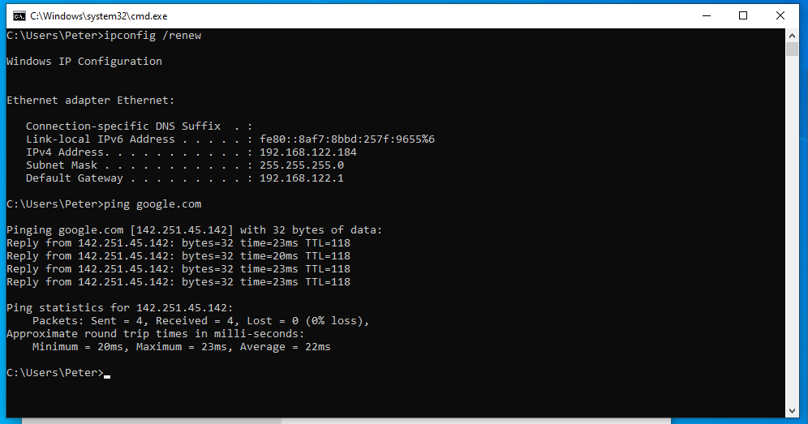

> Successful ping confirms restored connectivity.

---

### Issue 2: DNS Resolution Failure

**Symptoms:**  
User reported that websites would not load despite having an active internet connection.

**Investigation:**  
Tested connectivity using `ping google.com` and `ping 8.8.8.8` to isolate DNS vs network issue.

**Cause:**  
Incorrect DNS server configuration prevented hostname resolution.

**Resolution:**  
Updated DNS settings to a valid DNS server.

**Verification:**  
Confirmed successful DNS resolution by pinging a domain name.

#### Problem Identified

> Domain name resolution failing while IP connectivity remains functional.

#### Investigation
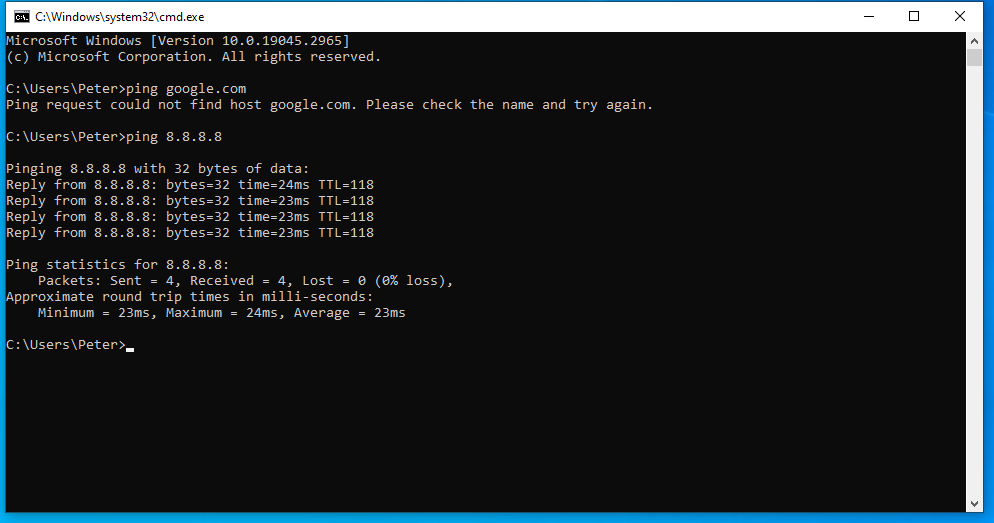

> Ping to IP successful, domain name fails indicating DNS issue.

#### Resolution
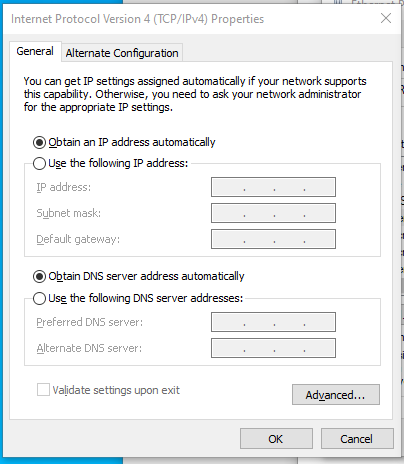

> DNS server corrected in network adapter settings.

#### Verification
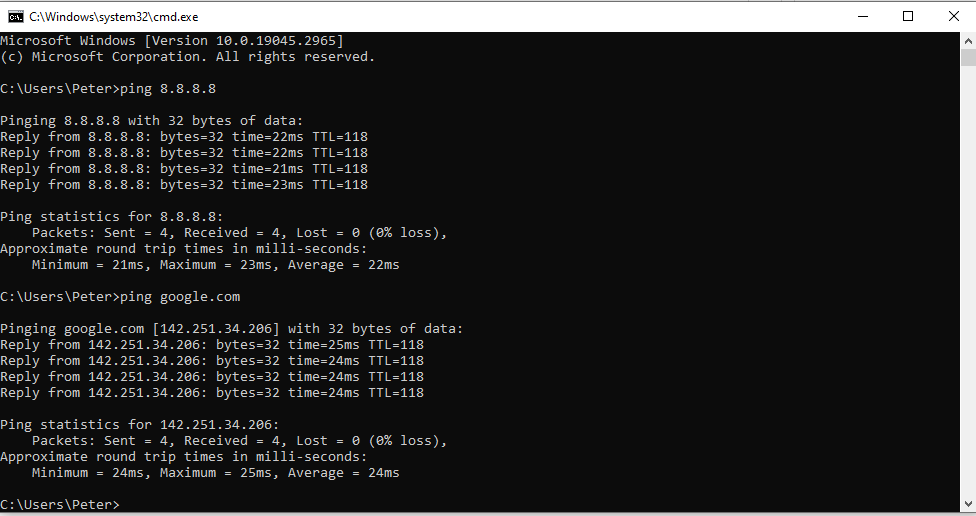

> Domain successfully resolves after DNS fix.

---

### Issue 3: Slow System Performance

**Symptoms:**  
User reported slow system startup and reduced performance.

**Investigation:**  
Reviewed startup applications in Task Manager.

**Cause:**  
Excessive startup applications consuming system resources.

**Resolution:**  
Disabled unnecessary startup programs.

**Verification:**  
Observed improved startup performance and reduced system load.

#### Problem Identified
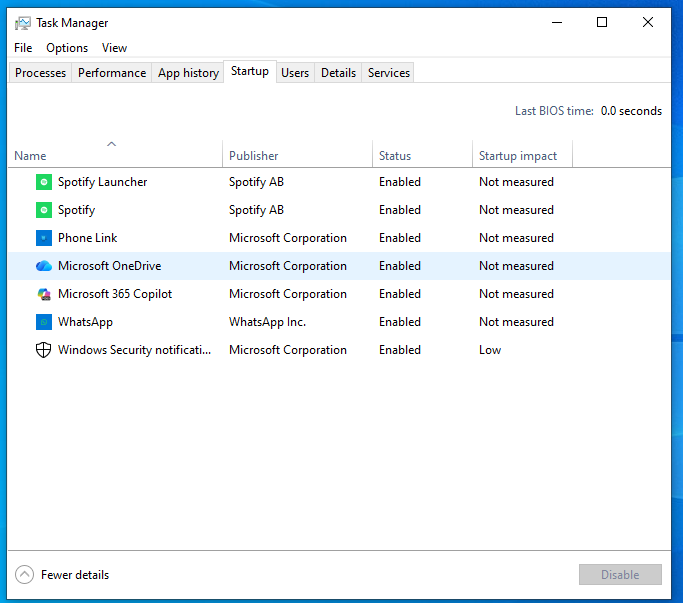

> Multiple startup applications enabled.

#### Resolution
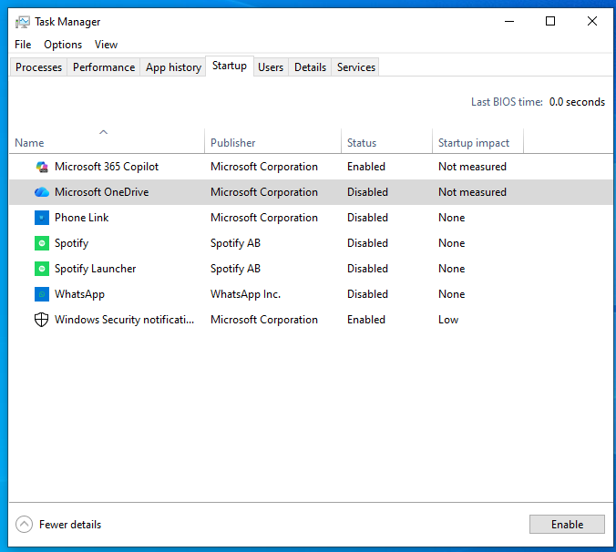

> Non-essential applications disabled.

#### Verification
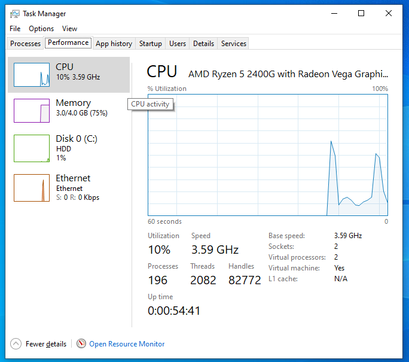

> Reduced system load after optimization.

---

### Issue 4: Permission Denied Access

**Symptoms:**  
User received "Access Denied" error when attempting to access a folder.

**Investigation:**  
Reviewed folder security settings and user permissions.

**Cause:**  
User lacked appropriate permissions to access the folder.

**Resolution:**  
Modified folder permissions to grant necessary access.

**Verification:**  
User successfully accessed the folder after permissions were updated.

#### Problem Identified
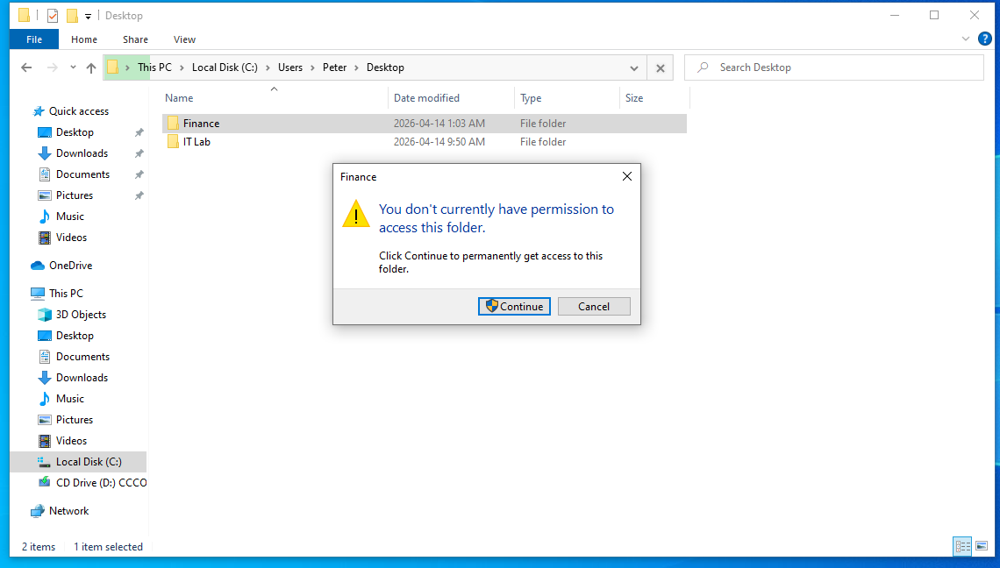

> User unable to access restricted folder.

#### Investigation
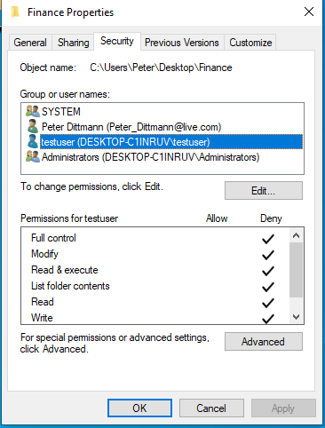

> Missing permissions identified in security settings.

#### Resolution

> Correct permissions applied.

#### Verification
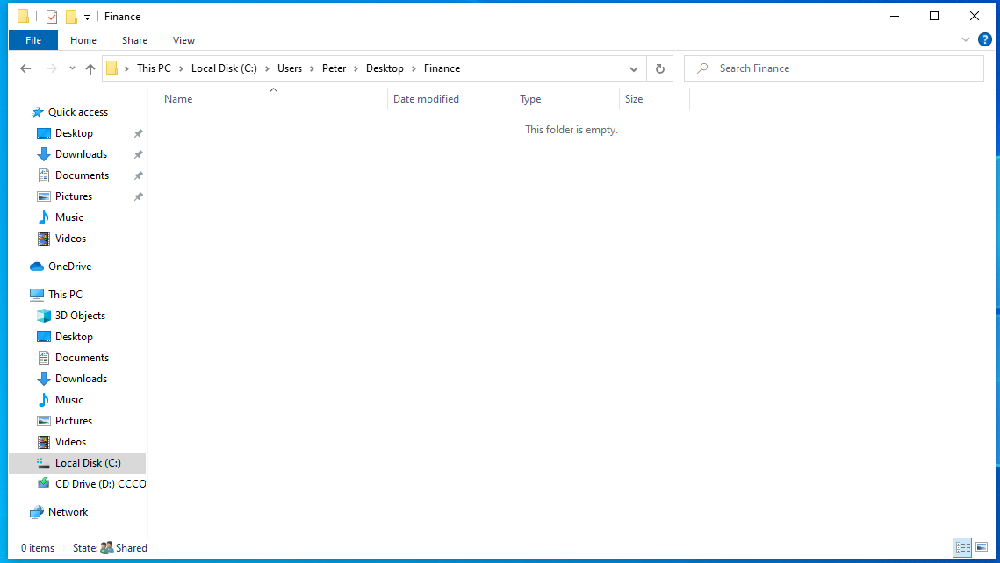

> User successfully accessing folder.

---

### Issue 5: Print Spooler Failure

**Symptoms:**  
User reported print jobs stuck in queue and unable to print.

**Investigation:**  
Checked system services and printer queue.

**Cause:**  
Print Spooler service was stopped.

**Resolution:**  
Restarted the Print Spooler service.

**Verification:**  
Print functionality restored and jobs processed successfully.

#### Problem Identified
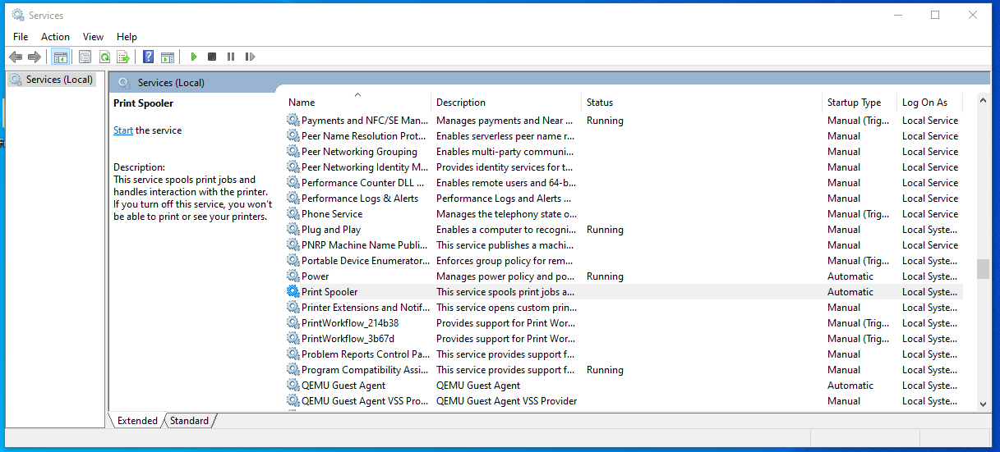

> Print Spooler service not running.

#### Resolution

> Service restarted successfully.

#### Verification
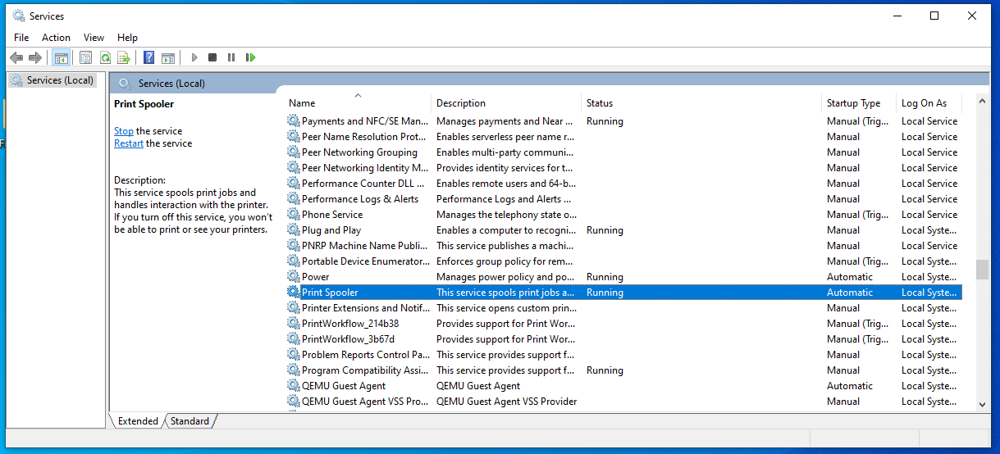

> Service running and ready for print jobs.

---

### Issue 6: Disk Space Issue

**Symptoms:**  
User reported system warnings about low disk space.

**Investigation:**  
Checked storage usage in system settings.

**Cause:**  
Disk filled with unnecessary files.

**Resolution:**  
Removed unnecessary files and freed up storage.

**Verification:**  
Confirmed available disk space increased and warnings resolved.

#### Problem Identified
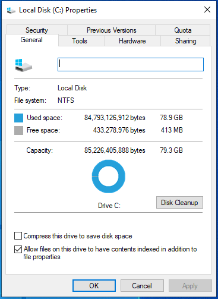

> System indicating critically low storage.

#### Investigation
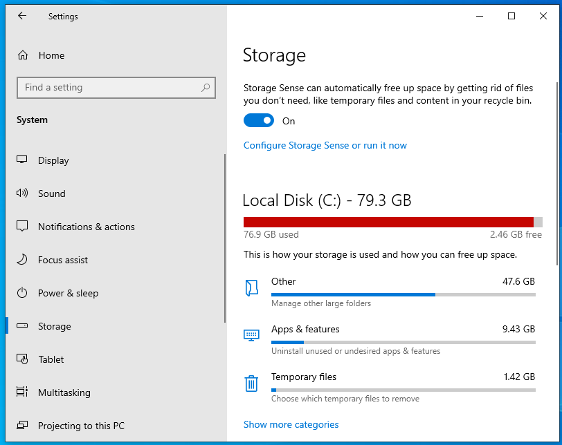

> Disk usage analysis showing full storage.

#### Resolution
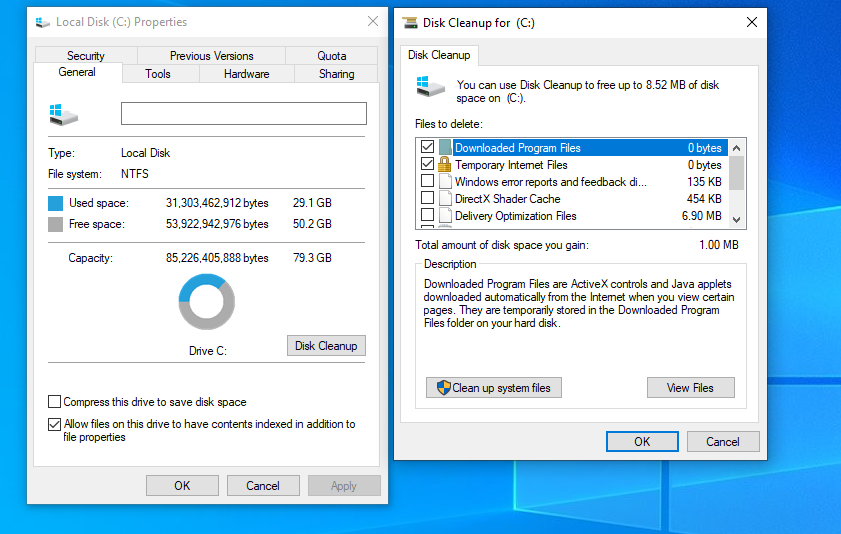

> Files removed and storage cleared.

#### Verification
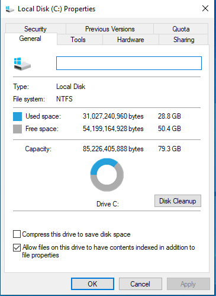

> Storage successfully freed.

---

## Key Skills Demonstrated

- Windows troubleshooting and diagnostics  
- Network troubleshooting (IP, DNS)  
- System performance optimization  
- File and folder permission management  
- Service troubleshooting (Print Spooler)  
- Disk space management  
- Structured troubleshooting methodology  
- Technical documentation  

---

## Key Takeaways

This project developed practical experience in diagnosing and resolving common IT support issues using a structured approach. It reinforced the importance of identifying root causes, applying targeted fixes, and verifying outcomes before closing a support task.

---

## Resume Bullet Points

- Simulated real-world IT support scenarios to diagnose and resolve network, system, and access-related issues  
- Troubleshot connectivity issues including IP configuration and DNS failures  
- Resolved system performance issues by analyzing and optimizing startup processes  
- Managed file permissions and resolved access control issues  
- Diagnosed and restored services such as Print Spooler  
- Documented troubleshooting workflows using structured methodology  
